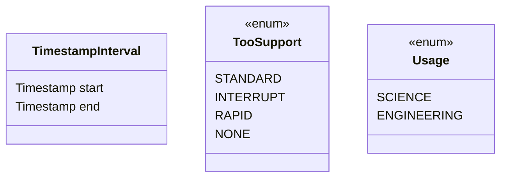
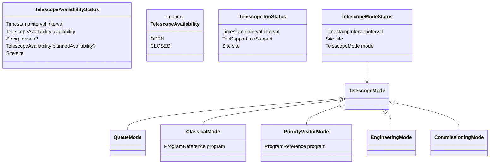
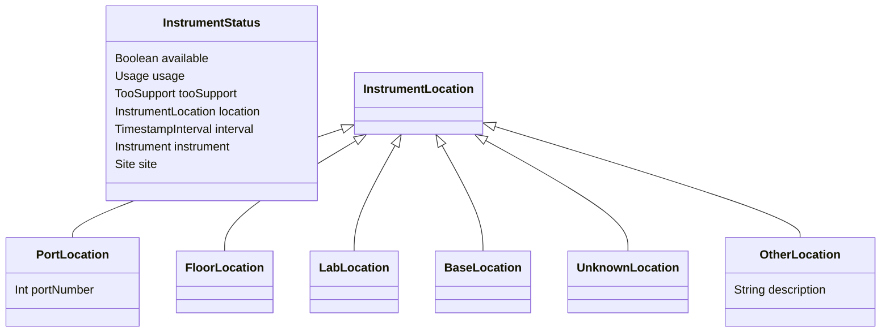
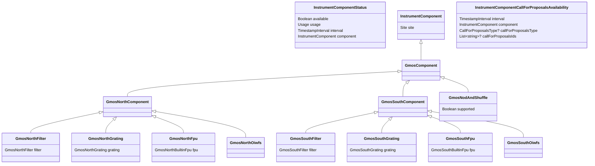

# Resource Service — Initial Domain Model

## Core

The calendar domain uses `TimestampInterval` from **lucuma-core** as the
canonical representation of time ranges. It defines an interval
`[start, end)`.

Source:
https://github.com/gemini-hlsw/lucuma-core/blob/main/modules/core/shared/src/main/scala/lucuma/core/util/TimestampInterval.scala

## Telescope

These types describe telescope-level calendar entries.
Each entry applies to a specific site (GN/GS) and a specific time range.

## Instruments

These types describe instrument availability, usage mode, and ToO capability over time.

## Instrument Components Status and Call for Proposals Component Availability

Component operational status over time.
These types describe instrument component definitions.
GMOS components shown here; other instruments may extend InstrumentComponent similarly.
Proposal availability does not necessarily match operational availability for components.

