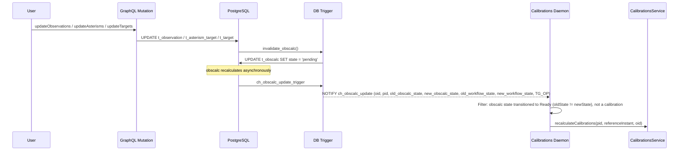
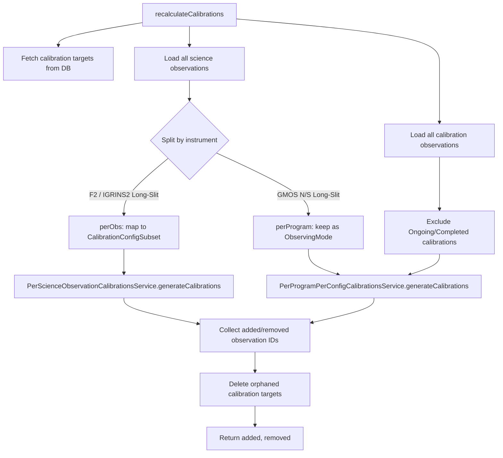
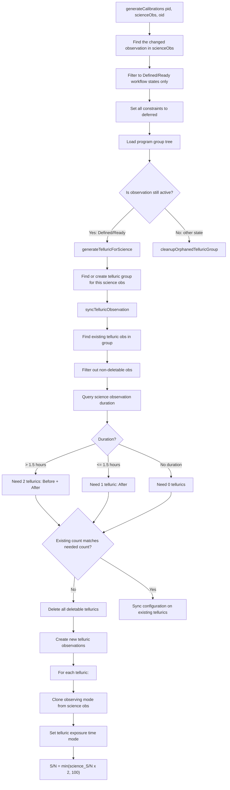
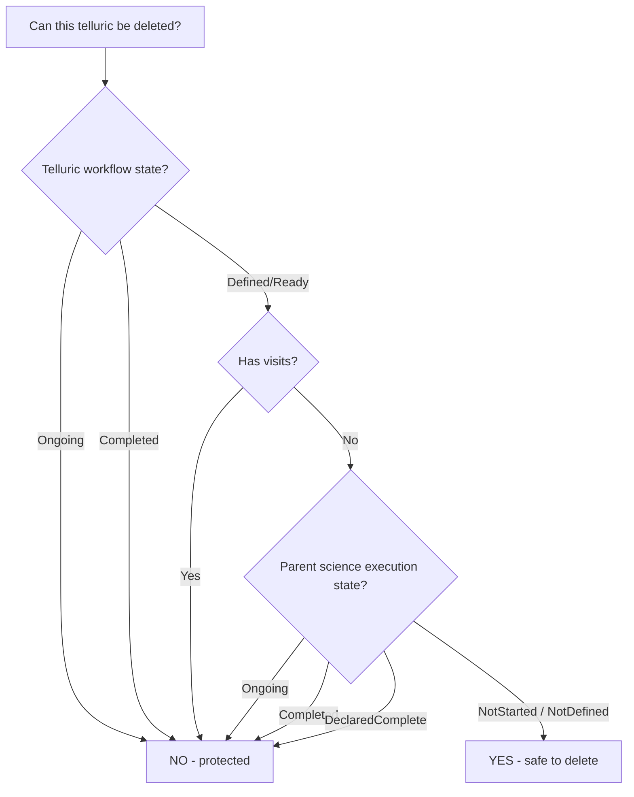
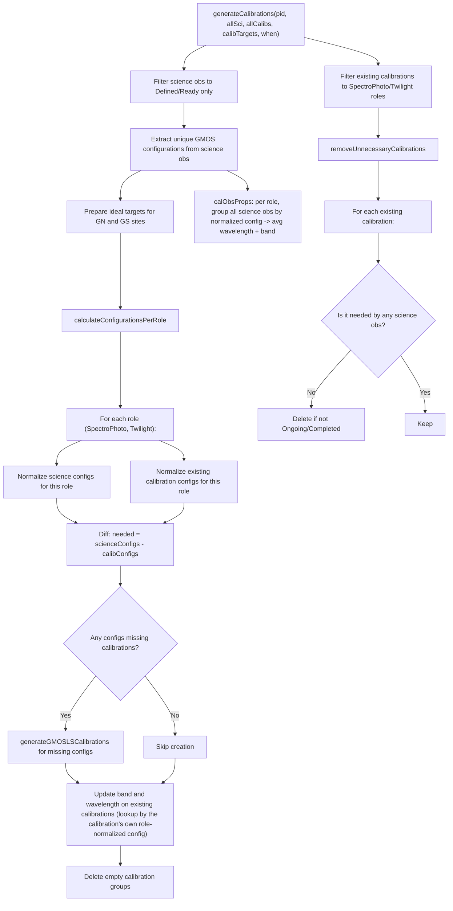
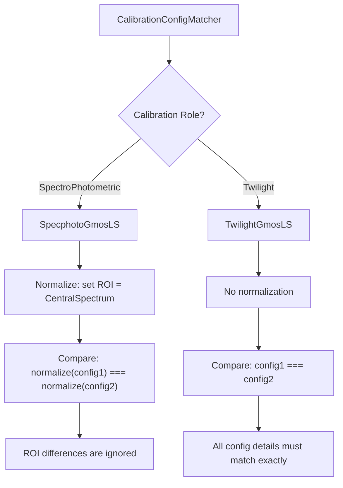
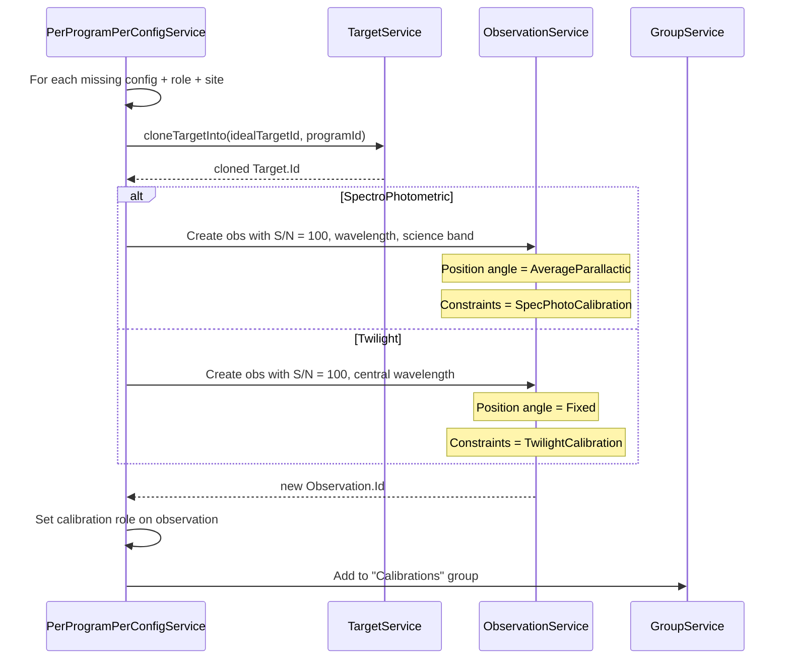
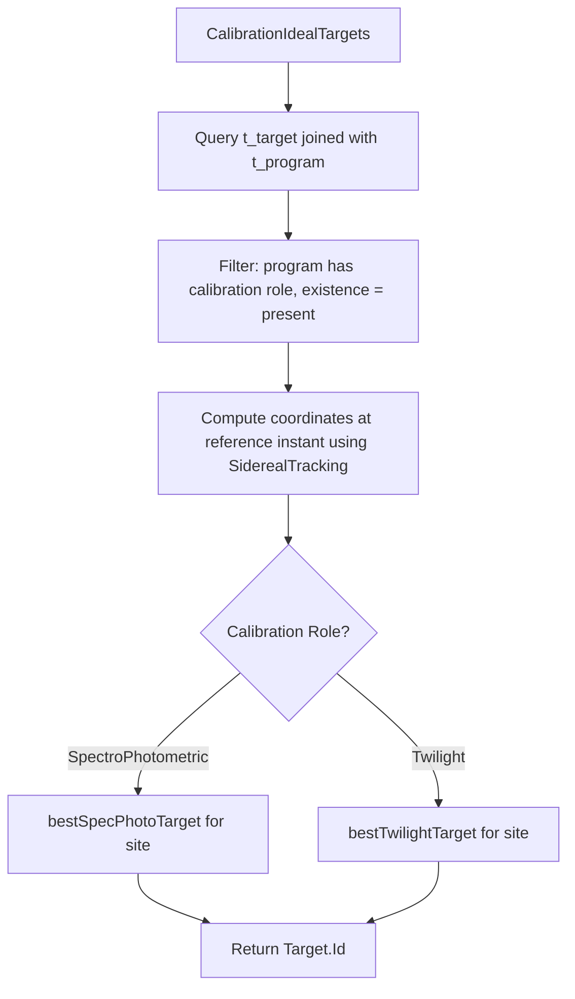
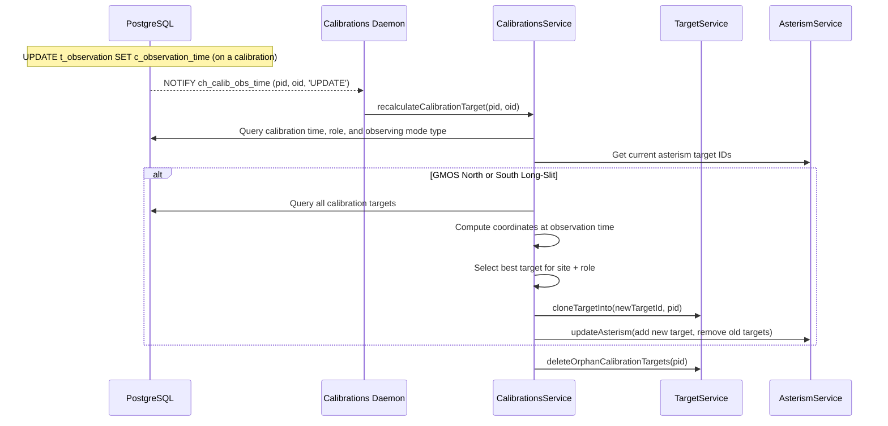

# Calibration Generation Flow

## Overview

The ODB automatically generates calibration observations for science programs. When a science observation's configuration changes, a background daemon detects the change and triggers calibration recalculation. There are two distinct strategies depending on the instrument and calibration type.

## Trigger Chain

All calibration generation begins with a database change detected via PostgreSQL NOTIFY/LISTEN channels.

## Entry Point: `recalculateCalibrations`

`CalibrationsService.scala:136`

This method orchestrates both calibration strategies. It loads all observations for the program, splits them by instrument type, and delegates to the appropriate service.

## Strategy 1: Per-Science-Observation Calibrations (F2 / IGRINS2 Telluric)

`PerScienceObservationCalibrationsService.scala`

Each Flamingos2 or IGRINS2 science observation gets its own telluric calibration observations. The number of tellurics depends on the science observation's execution duration. Matching between instruments is handled by `CalibrationConfigMatcher` (`Flamingos2LS`, `Igrins2LS`) and `ObsExtract.perObsFilter` accepts both `Flamingos2Config` and `Igrins2Config`.

### Flow

### Telluric Observation Details

- Telluric observations are placed in a **group with the science observation**
- The observing mode is **cloned from the science observation** with adjusted exposure parameters
- Groups are ordered: `[Telluric Before, Science, Telluric After]` or `[Science, Telluric After]`
- Telluric observations are created with `calibrationRole = Telluric`; their workflow validation state resolves directly to `Defined` (calibrations skip the regular validation path in `ObservationWorkflowService`)

### Telluric Workflow State Mirroring

The telluric's effective workflow state is **inherited from its parent science observation** rather than stored on the telluric itself:

- `ObservationValidationInfo.effectiveUserState` returns `associatedUserState` when `role === Telluric` (`ObservationWorkflowService.scala:142`); that value is pulled via a `LEFT JOIN t_observation s` on the same `c_group_id` with `c_calibration_role IS NULL` (`ObservationWorkflowService.scala:810`).
- While the telluric's state is `<= Ready`, `allowedTransitions` is forced to `Nil` (line 467). Direct calls to `setWorkflowState` on a telluric are rejected with `InvalidWorkflowTransition` (`graphql/mapping/AccessControl.scala:739`).
- Setting the science obs to `Ready` promotes the telluric from `Defined` to `Ready`; setting science to `Inactive` flips the telluric to `Inactive` (line 460 ensures `Inactive` overrides `Ongoing`).

### Telluric Target Resolution

After a telluric observation is created, `TelluricTargetsService` asynchronously resolves its target star from HIP catalog data. Brightness limits (`c_hmin_hot`, `c_hmin_solar`) are loaded at startup into an `HminBrightnessCache` keyed by `HminBrightnessKey.F2(disperser, filter, fpu)` or `HminBrightnessKey.Igrins2`. For F2 the key comes from the instrument config; IGRINS2 has a single entry because it has no per-config variation.

### Deletion Protection

All calibration deletion guards in `CalibrationsUtils.scala` read execution state from `v_generator_params.c_execution_state` (an `ExecutionState`) rather than `t_obscalc.c_workflow_state`. `v_generator_params` is derived directly from `t_execution_event` / `t_step_execution`, so it flips to `ongoing` the moment an event lands — no obscalc recalc required. This applies to:

- `excludeOngoingAndCompleted` — base helper used by the GMOS deletion paths (`CalibrationsService.recalculateCalibrations`, `PerProgramPerConfigCalibrationsService.removeUnnecessaryCalibrations`).
- `excludeFromDeletion` — composes the above with a `t_visit`-based check.
- `excludeTelluricsFromDeletion` — also checks the **parent science observation** in the same group, for the sc-8614 case where the parent has started executing but obscalc hasn't refreshed.

For tellurics specifically, even if the telluric's own mirrored state still says `Defined`/`Ready`, the telluric is protected when the parent science obs has started executing (`Ongoing`, `Completed`, or `DeclaredComplete`).

The parent state is resolved by `selectTelluricScienceExecutionStates`, which joins `t_observation` to itself by `c_group_id` (picking the row with `c_calibration_role IS NULL`) and then to `v_generator_params` for the execution state. Both `syncTelluricObservation` and `cleanupOrphanedTelluricGroup` use this filter.

## Strategy 2: Per-Program-Per-Config Calibrations (GMOS SpectroPhotometric + Twilight)

`PerProgramPerConfigCalibrationsService.scala`

For GMOS North and South Long-Slit, the system creates **one calibration observation per unique instrument configuration per calibration role** across the entire program. Multiple science observations sharing the same config share a single calibration.

### Flow

`calObsProps` keys props by each science observation's **role-normalized** config — the same normalization applied to a calibration's stored config
at creation (see Configuration Matching below) — producing a `Map[CalibrationConfigSubset, CalObsProps]` per role. Both creation and the
existing-calibration update look up by the calibration's own role, so the key always matches. Keying by the raw config instead would silently
miss any calibration whose normalized fields differ — e.g. a specphot calibration's ROI is normalized to `CentralSpectrum`, so a `FullFrame`
science obs would never match it, leaving its S/N λ stale.

### Configuration Matching

The matching logic differs by calibration role:

### Calibration Observation Creation

### Target Selection

Calibration targets are pre-defined in the database under calibration programs. The system selects the best target for a given site and role using `CalibrationIdealTargets`:

## Calibration Target Recalculation

A separate flow handles updating a calibration's target when its observation time changes.

## Workflow State Guards Summary

| Operation | Allowed States | Blocked States |
|-----------|---------------|----------------|
| Process science observation | Defined, Ready | All others |
| Modify calibration observation | execution state NotStarted/NotDefined | Ongoing, Completed, DeclaredComplete |
| Delete calibration observation | execution state NotStarted/NotDefined (no visits) | Ongoing, Completed, DeclaredComplete, or has visits |
| Delete telluric calibration | Above, **and** parent science obs execution state NotStarted/NotDefined | Same as above, plus parent science Ongoing/Completed/DeclaredComplete |
| Directly transition a telluric via `setWorkflowState` | None (while ≤ Ready) | All transitions rejected; state mirrors science obs |
