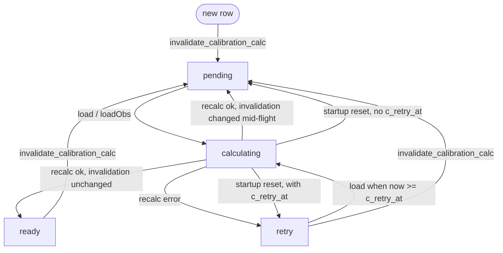
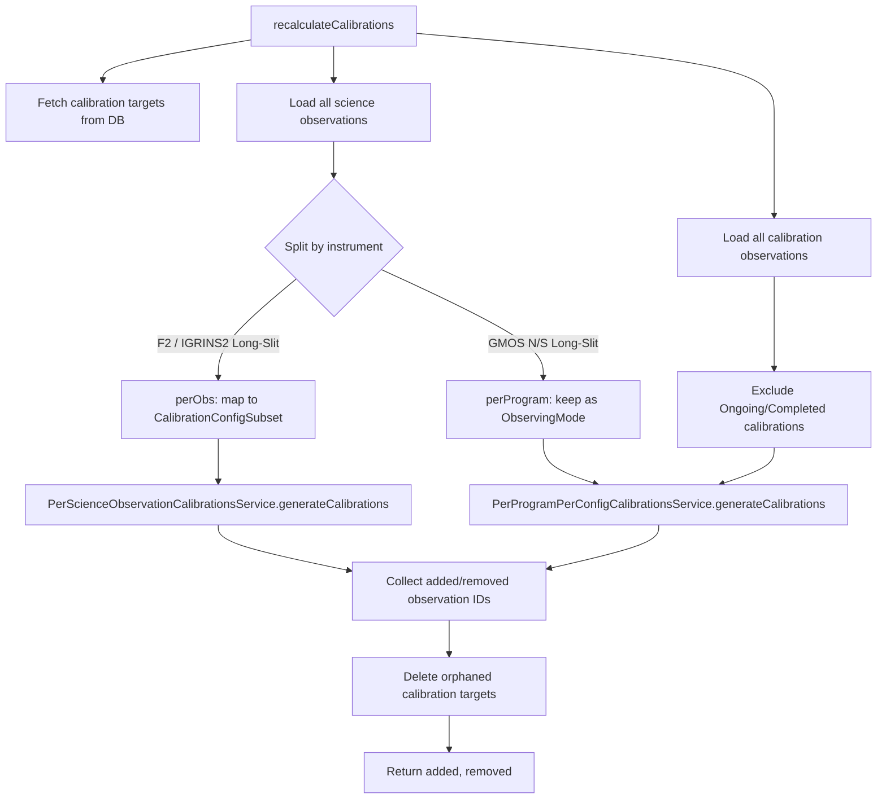
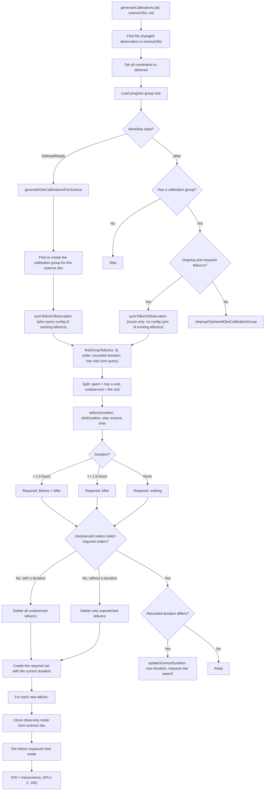
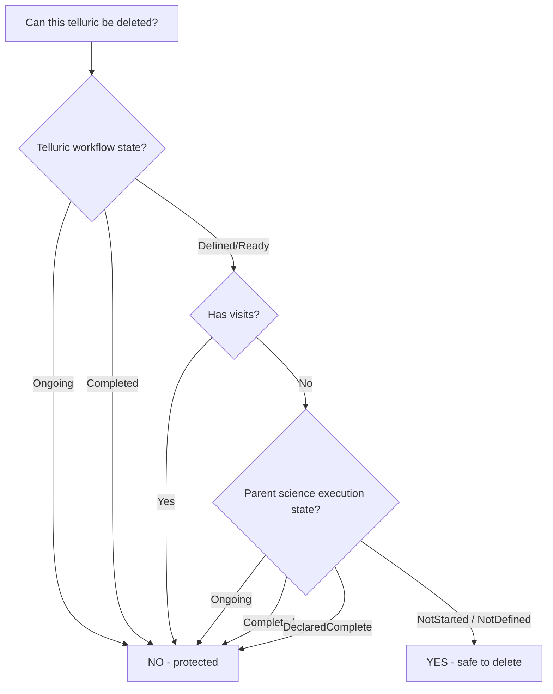
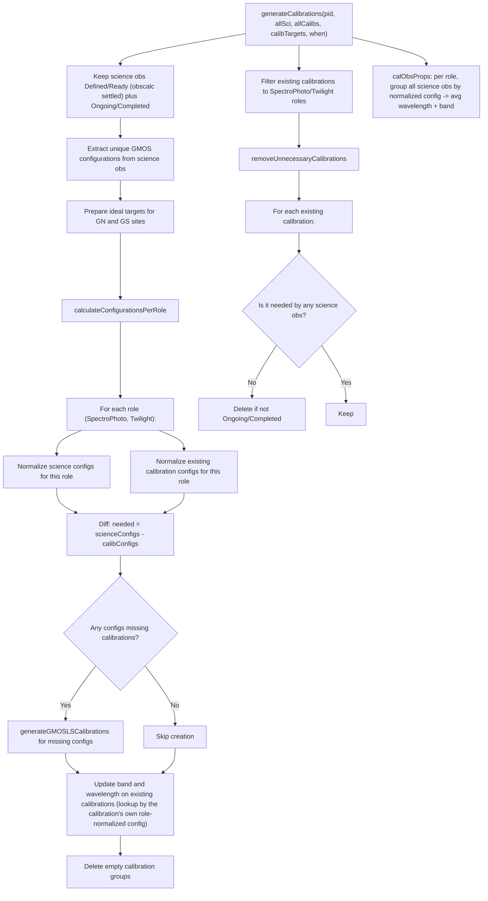
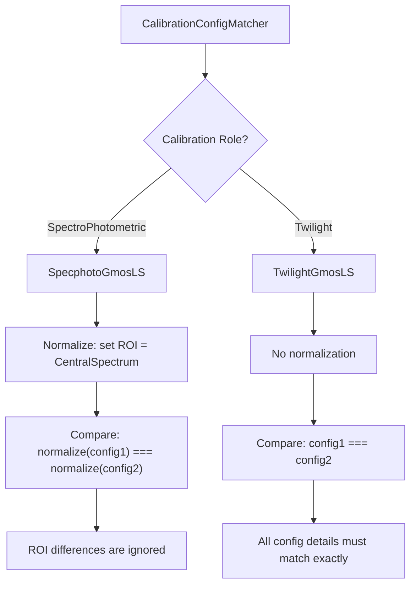
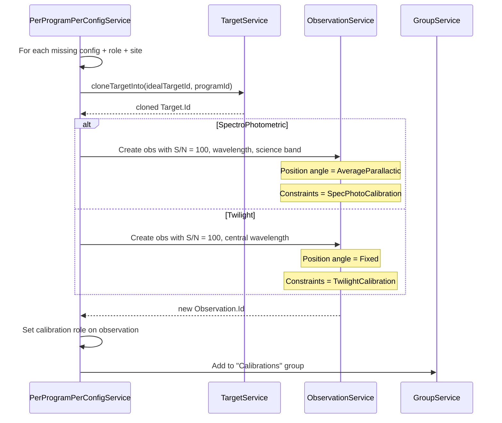
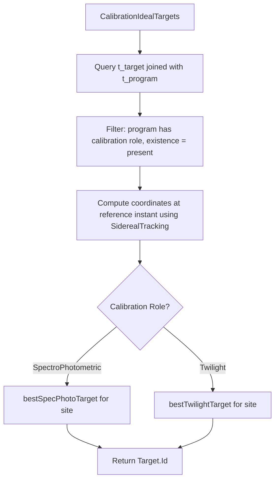
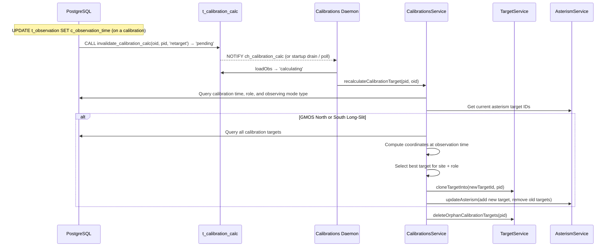

# Calibration Generation Flow

## Overview

The ODB automatically generates calibration observations for science programs. When a science observation's configuration changes and its obscalc settles to `Ready`, a background daemon recalculates the program's calibrations.

Recalculation is now driven by a **durable, database-backed work queue**
(`t_calibration_calc`) rather than a direct `ch_obscalc_update` subscription. A DB
trigger enqueues work when a non-calibration observation's obscalc settles; the
daemon drains the queue on startup, on NOTIFY, and on a periodic poll. This means
**no work is lost if the daemon is down** — rows left `pending` are replayed on
restart (startup reconciliation). There are two distinct calibration strategies
depending on the instrument and calibration type.

## Trigger Chain

Calibration generation begins when obscalc settles a non-calibration observation
to `Ready`. The durable queue (`t_calibration_calc`) sits between obscalc and
the daemon, exactly like `t_obscalc` and `t_telluric_resolution`.

```mermaid
sequenceDiagram
    participant User
    participant GraphQL as GraphQL Mutation
    participant DB as PostgreSQL
    participant Obscalc as Obscalc Daemon
    participant Trig as cascade_calibration_invalidation
    participant Queue as t_calibration_calc
    participant Notify as ch_calibration_calc
    participant Daemon as Calibrations Daemon
    participant Service as CalibrationsService

    User->>GraphQL: updateObservations / updateAsterisms / updateTargets
    GraphQL->>DB: UPDATE t_observation / t_asterism_target / t_target
    DB->>DB: invalidate_obscalc() → t_obscalc state = 'pending'
    Obscalc->>DB: storeResult → t_obscalc.c_last_update, state = 'ready'
    DB->>Trig: AFTER UPDATE OF c_last_update ON t_obscalc
    Trig->>Trig: non-calibration obs? obscalc ready? c_last_update changed?
    Trig->>Queue: CALL invalidate_calibration_calc(oid, pid, 'recalc') → 'pending'
    Queue->>Notify: NOTIFY (oid, pid, old_state, new_state=pending)
    Note over Daemon: If down, row stays pending — replayed on startup drain
    Notify-->>Daemon: event → loadObs → 'calculating'
    Daemon->>Daemon: group batch by program; GMOS once + tellurics per obs
    Daemon->>Service: recalculateCalibrations(pid, referenceInstant, changedOids)
    Daemon->>Queue: markReady (guard c_last_invalidation) / markRetry on error
```

The daemon (`CalibrationCalcDaemon`) runs three things:
  - a **startup reset** (`calculating` → `pending`/`retry`) followed by a
    **startup drain** that loads batches until empty — this is the
    reconciliation that replays missed events;
  - an **event stream** on `ch_calibration_calc` (transitions to `pending`);
  - a **poll stream** that periodically claims a batch.

The `isCalibration(oid)` filter the daemon used to apply is now enforced by the
DB trigger (`c_calibration_role IS NOT NULL`), so calibration observations never
enter the queue and the daemon cannot recurse on its own output.

## Durable Queue: `t_calibration_calc`

Created by `V1295__calibration_calc.sql`; state machine in
`CalibrationCalcService.scala`. One row per observation, keyed
`c_observation_id`, mirroring `t_obscalc` / `t_telluric_resolution`.

`V1304__calibration_retarget.sql` adds `c_work_type` (`recalc` | `retarget`):
science observations enqueue `recalc` work when their obscalc settles, and
calibration observations enqueue `retarget` work when their observation time
changes. Science and calibration observation ids are disjoint, so one row per
id still holds and a row's work type never changes.

```mermaid
flowchart TD
    NEW([new row]) -->|invalidate_calibration_calc| PENDING[pending]
    PENDING -->|load / loadObs| CALCULATING[calculating]
    RETRY[retry] -->|load when now >= c_retry_at| CALCULATING
    CALCULATING -->|recalc ok, invalidation unchanged| READY[ready]
    CALCULATING -->|recalc ok, invalidation changed mid-flight| PENDING
    CALCULATING -->|recalc error| RETRY
    CALCULATING -->|startup reset, no c_retry_at| PENDING
    CALCULATING -->|startup reset, with c_retry_at| RETRY
    READY -->|invalidate_calibration_calc| PENDING
    RETRY -->|invalidate_calibration_calc| PENDING
```

Key behaviors:

- **Mid-flight guard.** `markReady` only sets `ready` if `c_last_invalidation`
  is unchanged from the claimed value; if the row was re-invalidated during
  recalculation it goes back to `pending` so the next pickup re-runs against the
  newer inputs.
- **Retry policy.** Every recalculation error is retryable: `markRetry` stores
  `c_error_message`, increments `c_failure_count`, and sets
  `c_retry_at = now() + 1 min * 2^min(failures, 5)` (capped ~32 min), matching
  obscalc's retry-indefinitely behavior. There is no terminal error state
  because `recalculateCalibrations` raises rather than returning an error value.
- **Granularity.** The queue is keyed per observation, but batch drains group
  claimed rows by `(c_program_id, c_work_type)`: the per-program GMOS diff runs
  once per program while the per-observation telluric sync and target retargets
  run per changed observation. The live event path processes one observation at
  a time, matching the previous behavior.
- **Concurrency.** `load` uses `FOR UPDATE SKIP LOCKED`, so parallel workers are
  safe. Two workers claiming observations of the same program across batches can
  both run the GMOS diff — harmless, since the diff is idempotent
  (needed-vs-existing).
- **No backfill.** The trigger covers obscalc updates from deploy forward;
  pre-existing drift is corrected on each program's next natural edit.

Known edge: a science observation **deleted** while the daemon is down cascades
its queue row away without enqueueing anything, so an orphaned calibration
survives until something else in the program triggers a recalc — same as the
previous live behavior, which also keyed on `Ready` transitions, not deletions.

## Entry Point: `recalculateCalibrations`

`CalibrationsService.scala`

This method orchestrates both calibration strategies. It accepts a
`NonEmptyList[Observation.Id]` of changed science observations: the per-program
(GMOS) strategy runs **once** for the program, while the per-observation
(telluric) strategy runs **once per changed observation**. A single-oid overload
is retained for callers that only have one oid. It loads all observations for
the program, splits them by instrument type, and delegates to the appropriate
service.

```mermaid
flowchart TD
    A[recalculateCalibrations] --> B[Fetch calibration targets from DB]
    A --> C[Load all science observations]
    A --> D[Load all calibration observations]
    D --> E[Exclude Ongoing/Completed calibrations]

    C --> F{Split by instrument}
    F -->|F2 / IGRINS2 Long-Slit| G[perObs: map to CalibrationConfigSubset]
    F -->|GMOS N/S Long-Slit| H[perProgram: keep as ObservingMode]

    G --> I[PerScienceObservationCalibrationsService.generateCalibrations]
    H --> J[PerProgramPerConfigCalibrationsService.generateCalibrations]
    E --> J

    I --> K[Collect added/removed observation IDs]
    J --> K
    K --> L[Delete orphaned calibration targets]
    L --> M[Return added, removed]
```

## Strategy 1: Per-Science-Observation Calibrations (F2 / IGRINS2 Telluric)

`PerScienceObservationCalibrationsService.scala`

Each Flamingos2 or IGRINS2 science observation gets its own telluric calibration observations. The number of tellurics follows the observation's planned visit: `obsDuration` (`c_observation_duration`) when set, otherwise the science time estimate from the execution digest (`telluricDuration`). Matching between instruments is handled by `CalibrationConfigMatcher` (`Flamingos2LS`, `Igrins2LS`) and `ObsExtract.perObsFilter` accepts both `Flamingos2Config` and `Igrins2Config`.

Editing `obsDuration` re-enqueues the calibration calculation for science observations (`cascade_calibration_duration_recalc_trigger`, V1326).

### Flow

```mermaid
flowchart TD
    A[generateCalibrations pid, scienceObs, oid] --> B[Find the changed observation in scienceObs]
    B --> D[Set all constraints to deferred]
    D --> E[Load program group tree]

    E --> F{Workflow state?}
    F -->|Defined/Ready| G[generateObsCalibrationsForScience]
    F -->|other| F2{Has a calibration group?}
    F2 -->|No| Z[Skip]
    F2 -->|Yes| F3{Ongoing and requests tellurics?}
    F3 -->|Yes| J2["syncTelluricObservation (count only: no config sync of existing tellurics)"]
    F3 -->|No| H[cleanupOrphanedObsCalibrationGroup]

    G --> I[Find or create the calibration group for this science obs]
    I --> J["syncTelluricObservation (also syncs config of existing tellurics)"]

    J --> K
    J2 --> K
    K["findGroupTellurics: id, order, recorded duration, has visit (one query)"] --> L[Split: spent = has a visit, unobserved = the rest]
    L --> M[telluricDuration: obsDuration, else science time]

    M --> N{Duration?}
    N -->|> 1.5 hours| O[Required: Before + After]
    N -->|<= 1.5 hours| P[Required: After]
    N -->|None| Q[Required: nothing]

    O --> R{Unobserved orders match required orders?}
    P --> R
    Q --> R

    R -->|No, with a duration| S[Delete all unobserved tellurics]
    R -->|No, without a duration| S2[Delete only unprotected tellurics]
    S --> T[Create the required set with the current duration]
    S2 --> T
    R -->|Yes| U{Recorded duration differs?}
    U -->|Yes| U2[updateScienceDuration: new duration, requeue star search]
    U -->|No| U3[Keep]

    T --> V[For each new telluric:]
    V --> W[Clone observing mode from science obs]
    W --> X[Set telluric exposure time mode]
    X --> Y["S/N = max(science_S/N x 2, 100)"]
```

Spent tellurics are never deleted or counted: the next visit gets its own set, so an observation can accumulate more tellurics than one visit needs. The unobserved ones are replaced as a set rather than reused one by one, so every telluric of a visit shares one recorded duration.

### Telluric Observation Details

- Telluric observations are placed in a **group with the science observation**
- The observing mode is **cloned from the science observation** with adjusted exposure parameters
- Groups are ordered: `[Telluric Before, Science, Telluric After]` or `[Science, Telluric After]`
- Telluric observations are created with `calibrationRole = Telluric`; their workflow validation state resolves directly to `Defined` (calibrations skip the regular validation path in `ObservationWorkflowService`)

### Telluric Workflow State Mirroring

The telluric's effective workflow state is **inherited from its parent science observation** rather than stored on the telluric itself:

- `ObservationValidationInfo.effectiveUserState` returns `associatedUserState` when `role === Telluric` (`ObservationWorkflowService.scala:142`); that value is pulled via a `LEFT JOIN t_observation s` on the same `c_group_id` with `c_calibration_role IS NULL` (`ObservationWorkflowService.scala:810`).
- While the telluric's state is `<= Ready`, `allowedTransitions` is forced to `Nil` (line 467). Direct calls to `setWorkflowState` on a telluric are rejected with `InvalidWorkflowTransition` (`graphql/mapping/AccessControl.scala:739`).
- Setting the science obs to `Ready` promotes the telluric from `Defined` to `Ready`; setting science to `Inactive` flips the telluric to `Inactive` (line 460 ensures `Inactive` overrides `Ongoing`).

### Telluric Target Resolution

After a telluric observation is created, `TelluricTargetsService` asynchronously resolves its target star from HIP catalog data. The search reads `c_science_duration` from `t_telluric_resolution`: it sizes the search window (capped at the max telluric duration) and picks the selection rule (over 1.5 hours match the telluric's order, otherwise the RA vs twilight LST rule). When the sync keeps a telluric whose recorded duration is outdated, `updateScienceDuration` writes the new one and requeues the search like `invalidate_telluric_resolution`; a row still `calculating` keeps its state and is requeued when its stale result fails to match `c_last_invalidation`. Brightness limits (`c_hmin_hot`, `c_hmin_solar`) are loaded at startup into an `HminBrightnessCache` keyed by `HminBrightnessKey.F2(disperser, filter, fpu)` or `HminBrightnessKey.Igrins2`. For F2 the key comes from the instrument config; IGRINS2 has a single entry because it has no per-config variation.

### Deletion Protection

All calibration deletion guards in `CalibrationsUtils.scala` read execution state from `v_generator_params.c_execution_state` (an `ExecutionState`) rather than `t_obscalc.c_workflow_state`. `v_generator_params` is derived directly from `t_execution_event` / `t_step_execution`, so it flips to `ongoing` the moment an event lands — no obscalc recalc required. This applies to:

- `excludeOngoingAndCompleted` — base helper used by the GMOS deletion paths (`CalibrationsService.recalculateCalibrations`, `PerProgramPerConfigCalibrationsService.removeUnnecessaryCalibrations`).
- `excludeFromDeletion` — composes the above with a `t_visit`-based check.
- `excludeObsCalibrationsFromDeletion` — also checks the **parent science observation** in the same group, for the sc-8614 case where the parent has started executing but obscalc hasn't refreshed.

For tellurics specifically, even if the telluric's own mirrored state still says `Defined`/`Ready`, the telluric is protected when the parent science obs has started executing (`Ongoing`, `Completed`, or `DeclaredComplete`).

```mermaid
flowchart TD
    A[Can this telluric be deleted?] --> B{Telluric workflow state?}
    B -->|Ongoing| C[NO - protected]
    B -->|Completed| C
    B -->|Defined/Ready| D{Has visits?}
    D -->|Yes| C
    D -->|No| F{Parent science execution state?}
    F -->|Ongoing| C
    F -->|Completed| C
    F -->|DeclaredComplete| C
    F -->|NotStarted / NotDefined| E[YES - safe to delete]
```

The parent state is resolved by `selectTelluricScienceExecutionStates`, which joins `t_observation` to itself by `c_group_id` (picking the row with `c_calibration_role IS NULL`) and then to `v_generator_params` for the execution state. `cleanupOrphanedObsCalibrationGroup` uses this filter. `syncTelluricObservation` uses it only when there is no duration; with a duration it deletes every unobserved telluric when the required orders change, including those of an ongoing science, since the replacements carry the current duration. Spent tellurics are never deleted.

## Strategy 2: Per-Program-Per-Config Calibrations (GMOS SpectroPhotometric + Twilight)

`PerProgramPerConfigCalibrationsService.scala`

For GMOS North and South Long-Slit, the system creates **one calibration observation per unique instrument configuration per calibration role** across the entire program. Multiple science observations sharing the same config share a single calibration.

### Flow

```mermaid
flowchart TD
    A["generateCalibrations(pid, allSci, allCalibs, calibTargets, when)"] --> B[Filter existing calibrations to SpectroPhoto/Twilight roles]
    A --> C["Keep science obs Defined/Ready (obscalc settled) plus Ongoing/Completed"]

    C --> D[Extract unique GMOS configurations from science obs]
    D --> E[Prepare ideal targets for GN and GS sites]
    A --> D2["calObsProps: per role, group all science obs by normalized config -> avg wavelength + band"]

    E --> F[calculateConfigurationsPerRole]
    F --> G["For each role (SpectroPhoto, Twilight):"]
    G --> H[Normalize science configs for this role]
    G --> I[Normalize existing calibration configs for this role]
    H --> J["Diff: needed = scienceConfigs - calibConfigs"]
    I --> J

    J --> K{Any configs missing calibrations?}
    K -->|Yes| L[generateGMOSLSCalibrations for missing configs]
    K -->|No| M[Skip creation]

    B --> N[removeUnnecessaryCalibrations]
    N --> O[For each existing calibration:]
    O --> P{Is it needed by any science obs?}
    P -->|No| Q[Delete if not Ongoing/Completed]
    P -->|Yes| R[Keep]

    L --> S["Update band and wavelength on existing calibrations (lookup by the calibration's own role-normalized config)"]
    M --> S
    S --> T[Delete empty calibration groups]
```

### Configuration Matching

The matching logic differs by calibration role:

```mermaid
flowchart TD
    A[CalibrationConfigMatcher] --> B{Calibration Role?}

    B -->|SpectroPhotometric| C[SpecphotoGmosLS]
    C --> D["Normalize: set ROI = CentralSpectrum"]
    D --> E["Compare: normalize(config1) === normalize(config2)"]
    E --> F["ROI differences are ignored"]

    B -->|Twilight| G[TwilightGmosLS]
    G --> H["No normalization"]
    H --> I["Compare: config1 === config2"]
    I --> J["All config details must match exactly"]
```

The same normalization keys `calObsProps`'s per-role props map, and since each calibration is created from a normalized config, the
wavelength/band update finds it by an exact lookup on the calibration's stored config. Keying by the raw config instead would miss any
calibration whose normalized fields differ (e.g. a `FullFrame` science obs vs its `CentralSpectrum` specphot calibration), leaving the S/N λ stale.

### Calibration Observation Creation

```mermaid
sequenceDiagram
    participant Service as PerProgramPerConfigService
    participant Target as TargetService
    participant Obs as ObservationService
    participant Group as GroupService

    Service->>Service: For each missing config + role + site
    Service->>Target: cloneTargetInto(idealTargetId, programId)
    Target-->>Service: cloned Target.Id

    alt SpectroPhotometric
        Service->>Obs: Create obs with S/N = 100, wavelength, science band
        Note over Obs: Position angle = AverageParallactic
        Note over Obs: Constraints = SpecPhotoCalibration
    else Twilight
        Service->>Obs: Create obs with S/N = 100, central wavelength
        Note over Obs: Position angle = Fixed
        Note over Obs: Constraints = TwilightCalibration
    end

    Obs-->>Service: new Observation.Id
    Service->>Service: Set calibration role on observation
    Service->>Group: Add to "Calibrations" group
```

### Target Selection

Calibration targets are pre-defined in the database under calibration programs. The system selects the best target for a given site and role using `CalibrationIdealTargets`:

```mermaid
flowchart TD
    A[CalibrationIdealTargets] --> B[Query t_target joined with t_program]
    B --> C["Filter: program has calibration role, existence = present"]
    C --> D[Compute coordinates at reference instant using SiderealTracking]
    D --> E{Calibration Role?}
    E -->|SpectroPhotometric| F[bestSpecPhotoTarget for site]
    E -->|Twilight| G[bestTwilightTarget for site]
    F --> H[Return Target.Id]
    G --> H
```

## Calibration Target Recalculation

A separate flow handles updating a calibration's target when its observation
time changes. It rides the same durable queue as recalculation: a trigger on
`t_observation.c_observation_time` (rows with a calibration role, comparing
with `IS DISTINCT FROM` so first-time sets fire too) enqueues a `retarget` row,
and the daemon's startup drain, event stream, poll, retry backoff, and
mid-flight guard all apply. The former NOTIFY-only `ch_calib_obs_time` channel
and its daemon are gone (V1304).

```mermaid
sequenceDiagram
    participant DB as PostgreSQL
    participant Queue as t_calibration_calc
    participant Daemon as Calibrations Daemon
    participant Service as CalibrationsService
    participant Target as TargetService
    participant Asterism as AsterismService

    Note over DB: UPDATE t_observation SET c_observation_time (on a calibration)
    DB->>Queue: CALL invalidate_calibration_calc(oid, pid, 'retarget') → 'pending'
    Queue-->>Daemon: NOTIFY ch_calibration_calc (or startup drain / poll)
    Daemon->>Queue: loadObs → 'calculating'
    Daemon->>Service: recalculateCalibrationTarget(pid, oid)

    Service->>DB: Query calibration time, role, and observing mode type
    Service->>Asterism: Get current asterism target IDs

    alt GMOS North or South Long-Slit
        Service->>DB: Query all calibration targets
        Service->>Service: Compute coordinates at observation time
        Service->>Service: Select best target for site + role
        Service->>Target: cloneTargetInto(newTargetId, pid)
        Service->>Asterism: updateAsterism(add new target, remove old targets)
    end

    Service->>Target: deleteOrphanCalibrationTargets(pid)
```

## Workflow State Guards Summary

| Operation | Allowed States | Blocked States |
|-----------|---------------|----------------|
| Count science obs toward GMOS calibrations | Defined, Ready (obscalc settled), Ongoing, Completed | All others |
| Process science observation (telluric path) | Defined, Ready | All others |
| Sync telluric count only (no config sync of existing tellurics) | Ongoing, with a calibration group and tellurics requested | All others |
| Modify calibration observation | execution state NotStarted/NotDefined | Ongoing, Completed, DeclaredComplete |
| Delete calibration observation | execution state NotStarted/NotDefined (no visits) | Ongoing, Completed, DeclaredComplete, or has visits |
| Delete telluric calibration | Above, **and** parent science obs execution state NotStarted/NotDefined; or, during a telluric sync with a duration, any telluric without visits | Has visits; otherwise as above |
| Directly transition a telluric via `setWorkflowState` | None (while ≤ Ready) | All transitions rejected; state mirrors science obs |
