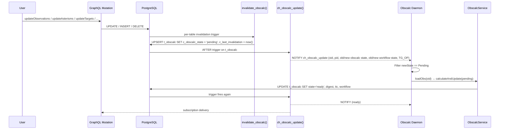
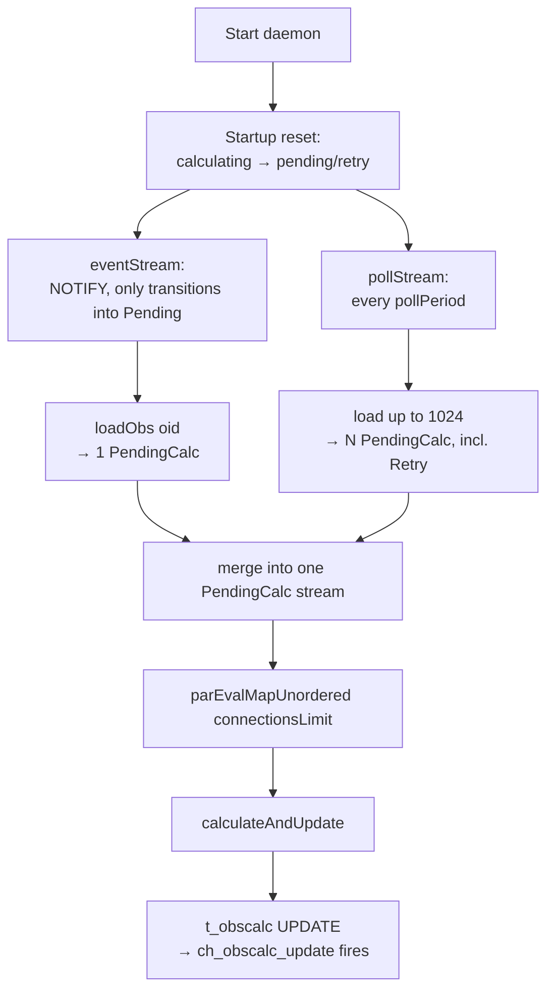
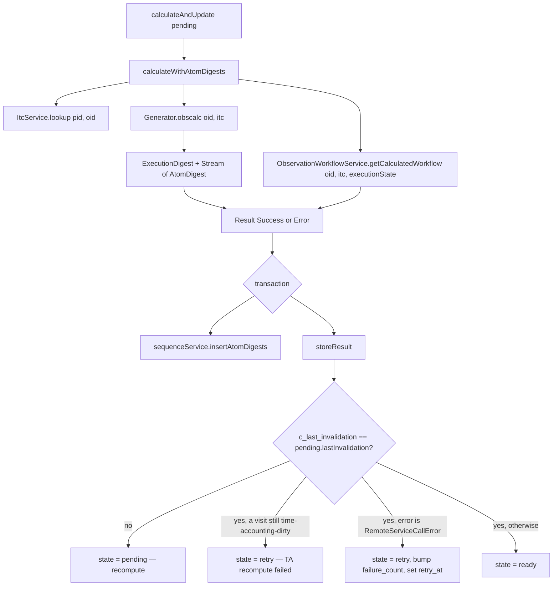
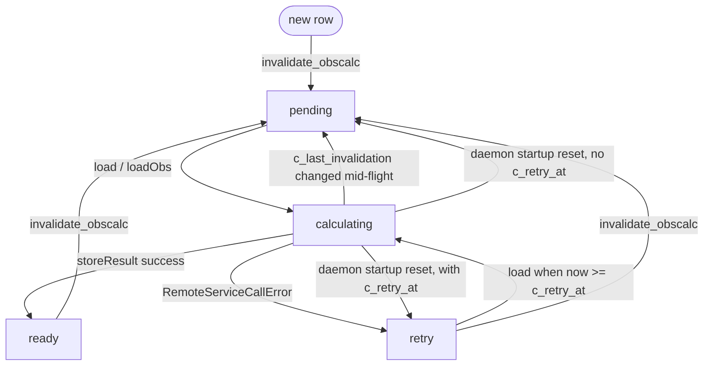

# Obscalc Flow

## Overview

`t_obscalc` caches the expensive per-observation derived values — ITC results, execution digest, workflow state — that the ODB serves to clients. A daemon recomputes entries asynchronously: database triggers mark rows `pending` whenever input data changes, the daemon picks them up, runs ITC + generator + workflow, and writes results back. PostgreSQL `NOTIFY` is used both to wake the daemon and to publish updates to GraphQL subscribers.

## Trigger Chain



## The `t_obscalc` Table

Composite primary key `(c_program_id, c_observation_id)`; cascades from `t_observation`.

### Calculation State Machine (`e_calculation_state`)

| State | Meaning |
|-------|---------|
| `pending` | Needs (re)calculation; eligible for pickup |
| `calculating` | A worker is computing it |
| `retry` | Recoverable error; will be retried after `c_retry_at` |
| `ready` | Result is current |

### Key Columns

- `c_last_invalidation` — bumped by every `invalidate_obscalc()` call; used to detect mid-flight re-invalidation.
- `c_retry_at`, `c_failure_count` — exponential backoff; constrained to be non-zero only in `retry` / `calculating`.
- `c_odb_error` (jsonb) — error result.
- ITC results: `c_img_*`, `c_spec_*` (target id, exposure time/count, wavelength, single/total S/N).
- Setup times: `c_full_setup_time`, `c_reacq_setup_time`.
- Digests: `c_acq_*`, `c_sci_*` (obs class, charged/non-charged time, offsets, atom count, execution state).
- Workflow: `c_workflow_state`, `c_workflow_transitions`, `c_workflow_validations`.

## Invalidation

All write paths funnel through one procedure: `invalidate_obscalc(observation_id)`.

- If the row doesn't exist → insert as `pending`.
- If currently `calculating` → bump `c_last_invalidation` and clear `c_retry_at` / `c_failure_count`, leaving the state as `calculating` (the result store will detect the changed invalidation and re-queue).
- Otherwise → flip to `pending`, clear `c_retry_at` / `c_failure_count`.

### Triggers Calling `invalidate_obscalc`

| Trigger | Source table | When |
|---------|--------------|------|
| `<table>_invalidate_trigger` (generated by FOREACH; function `obsid_obscalc_invalidate`) | `t_observation`, `t_asterism_target`, `t_gmos_north_long_slit`, `t_gmos_south_long_slit`, `t_flamingos_2_long_slit` | INSERT/UPDATE/DELETE |
| `target_invalidate_trigger` | `t_target` | UPDATE → invalidates every obs using the target |
| `dataset_qa_state_invalidate_trigger` | `t_dataset` | QA state crosses Pass/null ↔ Fail/Usable |
| `step_record_invalidate_trigger` | `t_step_record` | `c_completed` changes |
| `cfp_assignment_invalidate_obscalc_trigger` | `t_proposal` | CfP assignment changes |
| `cfp_edit_invalidate_obscalc_trigger` | `t_cfp` | CfP edits |
| `cfp_instrument_invalidate_obscalc_trigger` | `t_gemini_cfp_instrument` | INSERT/UPDATE/DELETE |
| `configreq_invalidate_obscalc_trigger` | `t_configuration_request` | INSERT/UPDATE/DELETE |

## Notification: `ch_obscalc_update`

Payload (CSV):

```
observation_id, program_id, old_obscalc_state, new_obscalc_state, old_workflow_state, new_workflow_state, TG_OP
```

Fires AFTER any INSERT/UPDATE/DELETE on `t_obscalc`, deferrable.

Subscribers:
- **Obscalc daemon** — wakes on transitions to `pending`.
- **GraphQL `obscalcUpdate` subscription** — delivered to clients via `ObscalcUpdateMapping`.
- **Calibrations daemon** — same channel; filters on workflow-state changes to trigger calibration regeneration (see `calibration-generation-flow.md`).

## Obscalc Daemon

### Main Loop

`runObscalcDaemon` (Main.scala:142):

The daemon runs two concurrent source streams that both emit `PendingCalc` items.
`merge` combines them into a single stream, which is then processed with bounded
parallelism. Startup `reset` runs once before the streams begin.



- Pickup uses `SELECT ... FOR UPDATE SKIP LOCKED` (`ObscalcService.scala:524`, `:542`) so multiple daemon instances / workers don't contend.
- Parallelism is bounded by `maxObscalcConnections`; each worker holds one DB connection during its calculation.

## `ObscalcService.calculateAndUpdate`

`ObscalcService.scala:127, 298`



### Inputs Composed

| Service | Provides |
|---------|----------|
| `ItcService.lookup` (`ItcService.scala:73`) | Cached or remote ITC result (imaging + spectroscopy) |
| `Generator.obscalc` (`Generator.scala:299`) | `ExecutionDigest` (acq + sci) and per-atom `AtomDigest` stream |
| `ObservationWorkflowService.getCalculatedWorkflow` (`ObservationWorkflowService.scala:87`) | Workflow state, allowed transitions, validation errors |

### Result Storage Guard

`storeResult` (`ObscalcService.scala:286`) locks the row and re-reads `c_last_invalidation`. If it changed during calculation, the result is *still* written but the state is forced back to `pending` so the next pickup re-runs against the newer inputs. It also checks whether any of the observation's visits is still time-accounting-dirty (a recompute that failed): if so — and `c_last_invalidation` is unchanged — the state is forced to `retry` so the time-accounting update is attempted again. See [`time-accounting-flow.md`](../service/time-accounting-flow.md).

### Retry Backoff

`Statements.storeResult` (`ObscalcService.scala:597`, formula at `:609`): on `retry`, `c_failure_count` is incremented and `c_retry_at = now() + interval '1 minute' * POWER(2, LEAST(c_failure_count, 5))` — capped at 32 minutes.

## State Transitions



## Result Consumption

GraphQL surfaces `t_obscalc` through:

- `ObscalcTable` (`graphql/table/ObscalcTable.scala`) — exposes calculation state, last invalidation/update, retry metadata, and workflow fields.
- `ExecutionMapping` (`graphql/mapping/ExecutionMapping.scala`) — joins ObscalcTable for execution digest, ITC, and workflow on observation queries.
- `ObscalcUpdateMapping` (`graphql/mapping/ObscalcUpdateMapping.scala`) — fans the `ch_obscalc_update` notification out as a GraphQL subscription with edit type and old/new states.

Service-side helpers on `ObscalcService`:

- `selectOne` / `selectMany` / `selectProgram` — read entries.
- `selectManyExecutionDigest` — decode digest column into `CalculatedValue[Result[ExecutionDigest]]`.
- `selectOneCategorizedTime` / `selectProgramCategorizedTime` — reconstruct `CategorizedTime` from digest columns; skips error rows and inactive observations.

Note: `v_generator_params.c_execution_state` (consumed by calibration deletion guards) is derived directly from `t_execution_event` / `t_step_execution` — *not* from `t_obscalc`. This means execution-state-driven protections do not need to wait for an obscalc refresh.

## Concurrency

- Pickup: `FOR UPDATE SKIP LOCKED` makes the queue safe for parallel workers and survives multiple daemon processes.
- Worker fan-out: `parEvalMapUnordered(connectionsLimit)` bounds parallelism to the connection pool size.
- Mid-flight invalidation: detected by comparing `c_last_invalidation` snapshots; loses no edits.
- Crash recovery: `reset()` on startup re-queues any row stuck in `calculating`.
