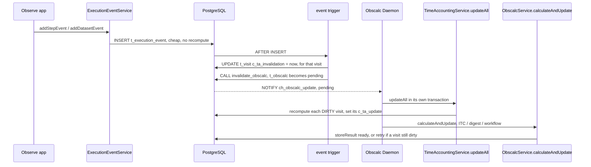

# Time Accounting Flow

## Overview

Time accounting is the record of how much observing time an execution consumed
and how it was charged. It is computed **per visit** and stored on `t_visit`
(`c_raw_*` and `c_final_*` interval columns), plus a set of discount rows in
`t_time_charge_discount`. It is *derived* data: a function of the visit's
execution events, its datasets' QA state, manual staff corrections, and the
observing night.

It is recomputed **asynchronously by the obscalc worker** rather than inline
when events arrive. An execution event only marks the affected visit dirty; the
worker picks the observation up and recomputes the dirty visits. This keeps the
event-ingestion path (from the "Observe" application) cheap.

See [`obscalc-flow.md`](obscalc-flow.md) for the worker/daemon
machinery this rides on.

## Where it lives

| Concern | Location |
|---|---|
| Compute a visit's invoice, write `t_visit` + discounts | `TimeAccountingService.update(visitId)` |
| Recompute all *dirty* visits of an observation | `TimeAccountingService.updateAll(observationId)` |
| Manual staff correction | `TimeAccountingService.addCorrection(visitId, …)` (synchronous) |
| Record an execution event (marks a visit dirty) | `ExecutionEventService` insert methods |
| Drive the recompute in the worker | obscalc daemon `Main.scala` `calcAndUpdateStream` |
| Retry decision when a recompute fails | `ObscalcService.storeResult` |
| Triggers, markers, procedures | migration `V1210__async_time_accounting.sql` |

## What causes time accounting to update

**Exactly two things change a visit's charge**, and each is scoped to a single
visit:

1. **An execution event** is recorded for the visit (`t_execution_event`, which
   has `c_visit_id NOT NULL`).
2. **A dataset's QA state** crosses `Pass`/null ↔ `Fail`/`Usable`
   (`t_dataset`, also `c_visit_id NOT NULL`) — this adds or removes a QA
   discount for the visit that contains the dataset.

Both go through `invalidate_visit_time_accounting(visit_id, observation_id)`,
which:

- `UPDATE t_visit SET c_ta_invalidation = now()` for **that visit only**, and
- `CALL invalidate_obscalc(observation_id)` so the worker picks the observation
  up (and the obscalc digest/workflow refresh too).

Manual corrections are handled **synchronously** in `addCorrection` (staff, rare)
and do **not** go through this path — they write the correction row and adjust
`t_visit` immediately.

## The per-visit dirty markers

`t_visit` carries two timestamps:

| Column | Meaning |
|---|---|
| `c_ta_invalidation` | Bumped to `now()` when this visit is invalidated (event / QA change). |
| `c_ta_update` | Set to the invalidation value that was just recomputed. |

A visit is **dirty** iff `c_ta_invalidation > c_ta_update`.
`updateAll(observationId)` selects only the observation's dirty visits,
recomputes each with `update(visitId)`, and sets that visit's `c_ta_update` to
the invalidation timestamp it observed.

Existing visits (at migration time) get equal default timestamps → not dirty →
never recomputed until a genuine change occurs.

## Why NOT recompute otherwise-unchanged visits

This is the central design invariant, and it is deliberate.

Time accounting is derived, but its stored values are also **acted on by
humans**: staff review the automated numbers and enter manual corrections, and a
program's charged time is a real accounting figure. Consider:

1. Visit V1 executes early in the semester; its charge is computed and staff add
   manual correction entries after reviewing it.
2. Months pass. The time-accounting **algorithm is changed** in a deploy.
3. A new visit V2 of the *same observation* begins executing.

If recomputing were scoped to the *observation* (recompute-all-visits), every
event in V2 would re-derive V1 as well — under the **new** algorithm. The
correction rows survive (they're reapplied from `t_time_charge_correction`), but
the base they sit on drifts, so V1's stored final charge silently changes away
from the value staff reviewed and approved. That is worse than losing the
corrections outright: it looks authoritative but no longer matches the human
decision.

Scoping the recompute to the **visit that actually changed** prevents this: V2's
events touch only V2; V1 is inviolate unless *it* receives an event or a QA
change. Recompute is fine when a human is actively making a relevant change
(even a post-deploy QA correction re-prices with the new algorithm — someone is
in the loop expecting it); the danger is only an *unrelated* trigger silently
picking up an algorithm change.

Two corollaries fall out of per-visit scoping:

- **Unrelated obscalc invalidations don't touch time accounting.** A target/mode
  edit, or a migration that blanket-sets observations to `pending`, invalidates
  obscalc but marks no visit dirty, so `updateAll` is a no-op. (This is why the
  markers are on `t_visit`, not `t_obscalc`.)
- **QA changes are handled correctly** even on an old, closed visit, because the
  QA trigger marks *that* visit dirty.

## Flow



Key point: `updateAll` runs in **its own transaction, before and independent of**
`calculateAndUpdate`. Time accounting is pure DB work; the ITC/digest calculation
can hit a remote service and fail. Keeping them separate means an ITC failure can
never stall or revert a time-accounting recompute.

## Interaction subtleties

### Retry when a recompute fails

`updateAll` is best-effort in the daemon (errors are logged and swallowed). If it
fails, the visit stays dirty (`c_ta_update` was never advanced). To avoid
orphaning that dirty state, `storeResult` checks whether **any** visit of the
observation is still dirty when the obscalc calculation finishes, and if so sets
the entry to `retry` (with the normal exponential backoff) instead of `ready` —
so the poll picks it up again and `updateAll` is retried.

### Failure vs. concurrent event — retry vs. pending

`storeResult` decides the final state in this order:

```
if c_last_invalidation changed since pickup      → pending   (re-invalidated during calc)
else if any visit still dirty                    → retry     (a recompute failed)
else                                             → ready
```

The ordering matters. A real event bumps **both** the visit's
`c_ta_invalidation` *and* `t_obscalc.c_last_invalidation` (the latter via
`invalidate_obscalc`). So an event that arrives *during* the calculation trips
the `pending` check first — it is correctly treated as "re-invalidated", not as a
failure. The `retry` branch is reached only when a visit is dirty **and**
`c_last_invalidation` is unchanged, which happens exclusively when `updateAll`
itself failed.

### Race safety

`updateAll` records `c_ta_update` = the `c_ta_invalidation` value it *observed*,
never `now()`. So if a new event bumps `c_ta_invalidation` while a recompute is
in flight, the visit is left dirty for the next pass rather than being marked
clean at a stale value — no lost update, regardless of commit order.

### No feedback loop

`updateAll` writes back to `t_visit` (both the result columns and `c_ta_update`).
`visit_invalidate_trigger` fires only on `INSERT`/`DELETE` of `t_visit`
(narrowed from `INSERT OR UPDATE OR DELETE` in V1210), so these `UPDATE`s do not
re-invalidate obscalc.

### Locking (deadlock avoidance)

Recording an execution event touches three rows via triggers —
`t_observation_execution` (the mutex), `t_obscalc` (`invalidate_obscalc`), and
`t_visit` (the invalidation marker) — so concurrent writers need both a
consistent **order** and the right lock **mode**. Get either wrong and you get
deadlocks.

#### The mutex: `t_observation_execution`

Every observation has exactly one row in `t_observation_execution`, created with
the observation. It carries `c_step_execution_order` and serves as **the** lock
for observation-scoped execution state. Take it through the helper:

```sql
PERFORM lock_observation_execution(observation_id);
```

It is deliberately *not* `t_observation`. Locking the observation row meant
serializing against every unrelated edit of that observation (any `UPDATE` of a
non-key column takes the same mode), and the counter living there meant every
step event wrote the widest, most-read, 46-times-FK-referenced row in the schema
— a dead tuple per step. Locking a row whose only job is this invariant costs
neither. Nothing FK-references `t_observation_execution`, so its rows are never
`KEY SHARE`-locked by child inserts and the mutex is a clean acquisition rather
than an upgrade.

#### Order

Acquire in this order, always:

```
t_observation_execution  →  t_obscalc  →  t_visit
```

`invalidate_visit_time_accounting` takes the mutex itself rather than relying on
another trigger having done it, so the order holds no matter which trigger fires
first (Postgres fires triggers in **name** order, which is not a thing to depend
on):

```sql
PERFORM lock_observation_execution(observation_id);
CALL invalidate_obscalc(observation_id);
UPDATE t_visit SET c_ta_invalidation = now() WHERE c_visit_id = visit_id;
```

**Why the order matters even though these writers already serialize on the
mutex.** They serialize only against *each other*, and plenty of writers never
take it at all: `invalidate_obscalc` goes straight to `t_obscalc` (11 triggers
reach it that way, via `obsid_obscalc_invalidate`), and the obscalc worker locks
`t_obscalc` and writes `t_visit` without ever touching the mutex. Those are safe
today only because each takes **one** of the three rows — it can block someone
without wanting anything back. The order is the rule that keeps that true: a path
claiming `t_obscalc` and *then* reaching for the mutex would deadlock against
every mutex-first path, and the mutex cannot prevent it because such a path never
participates in it.

Note also that the mutex is **per observation**. A transaction spanning several
observations is not serialized against another spanning the same set, so
multi-observation work needs its own deterministic ordering (lock them in a fixed
order, e.g. by id).

#### Mode: `FOR NO KEY UPDATE`, never `FOR UPDATE`

This is the part that is easy to get wrong, and it is *also* why the mutex was
moved off `t_observation` rather than merely weakened.

**46 tables FK-reference `t_observation`.** Inserting a row into any of them —
`t_execution_event`, `t_visit`, `t_atom`, `t_dataset`,
`t_sequence_materialization`, … — makes PostgreSQL take a **`FOR KEY SHARE`**
lock on the referenced `t_observation` row to enforce the foreign key. This
happens as part of the INSERT, **before any `AFTER` trigger runs**, and it is
invisible in the code.

`FOR UPDATE` is the **only** mode that conflicts with `FOR KEY SHARE`:

| requested ↓ / held → | KEY SHARE | SHARE | NO KEY UPDATE | UPDATE |
|---|---|---|---|---|
| **KEY SHARE** | ok | ok | ok | **conflict** |
| **NO KEY UPDATE** | **ok** | conflict | conflict | conflict |
| **UPDATE** | **conflict** | conflict | conflict | conflict |

So a trigger taking `FOR UPDATE` on the observation was *upgrading* a lock that
every concurrent child insert also held. `FOR KEY SHARE` is self-compatible, so
several transactions hold it at once, then each blocks upgrading — deadlock, and
no amount of ordering discipline in the trigger can prevent it, because the FK
lock is taken before any trigger exists to have an opinion.

Two consequences, and both still bind:

- **Never take `FOR UPDATE` on a row other tables FK-reference** unless you
  genuinely mean to block their inserts. `FOR NO KEY UPDATE` conflicts with
  itself — which is the entire requirement for a mutex — while staying compatible
  with the FK's `KEY SHARE`.
- **Prefer a row nothing FK-references at all.** That is what
  `t_observation_execution` is. Its rows are never `KEY SHARE`-locked, so the
  mutex is a fresh acquisition, not an upgrade, and it cannot false-share with
  ordinary observation edits.

#### What each lock is actually for

Keeping these straight is what makes the choices above obvious:

| Lock | Taken by | Protects |
|---|---|---|
| `FOR KEY SHARE` on `t_observation` (implicit) | the INSERT's FK check | the observation's *key* — stops it being deleted or key-updated while a child row referencing it is written |
| `FOR NO KEY UPDATE` on `t_observation_execution` (explicit) | `lock_observation_execution` | the *trigger bodies* — stops them interleaving |

They do different jobs on different rows, and the implicit one gives you **no**
mutual exclusion — it is the weakest mode and is self-compatible. The explicit
lock is doing all the serialization work; it is not redundant. Drop it from
`update_execution_information_for_step_event` and its
`IF NOT EXISTS … INSERT INTO t_step_execution` becomes a check-then-act race
(`c_step_id` is that table's primary key, so the loser gets a unique violation).

A corollary worth knowing: `lock_observation_execution` locks nothing if the row
is missing, which would mean *silently* no mutual exclusion. That is why the row
is created with the observation and why the helper self-heals rather than
assuming.

#### Rules for new code

1. To serialize observation-scoped execution work, call
   **`lock_observation_execution(observation_id)`** — first, before `t_obscalc`
   or `t_visit`. Don't invent a second mutex; a mutex only works if everyone
   agrees on it.
2. If you must lock some *other* row that tables FK-reference, use
   **`FOR NO KEY UPDATE`**. Reach for `FOR UPDATE` only if you genuinely need to
   block child inserts or to change a referenced key column — and say why in a
   comment.
3. An `AFTER` trigger can never establish lock ordering on the parent row, because
   the FK lock precedes it. If you need the parent locked first, do it in a
   `BEFORE` trigger or in application code before the insert.
4. Note that an `UPDATE` of a *referenced key* column (e.g.
   `t_observation.c_instrument`, part of the FK'd `(c_observation_id,
   c_instrument)` unique key) takes `FOR UPDATE` implicitly, and so conflicts with
   every child insert. That is unavoidable, but worth knowing when a bulk
   observation update starts deadlocking.
5. The step-execution counter lives on `t_observation_execution`, not
   `t_observation` (V1227 dropped the old column). Increment it under the mutex.

## What a recompute actually computes

`update(visitId)` rebuilds the visit's `TimeAccountingState` from **all** of its
events, then applies discounts and corrections to produce the invoice:

- **No-data discount** — visit has no datasets → whole charge discounted.
- **Daylight discount** — time outside the night's nautical twilight.
- **Overlap discount** — the portion overlapping another chargeable visit at the
  same site.
- **QA discount** — atoms whose datasets failed QA.
- **Corrections** — staff `Add`/`Subtract` entries from `t_time_charge_correction`
  are reapplied on top (so corrections survive a recompute; only the base they
  apply to reflects the current algorithm).

Final charge = raw execution time − discounts, then corrected.

## Known limitation: cross-visit overlap

The overlap discount makes one visit's charge depend on *another* visit. Per-visit
scoping only recomputes the visit that received an event/QA change, so if an
earlier visit is **open but no longer receiving events** while a new visit
overlaps it, the earlier visit will not be re-marked and could miss an overlap
adjustment. This is accepted: overlapping visits realistically both receive
events while concurrent (so both get marked and recomputed), and the alternative
— whole-observation recompute — reintroduces the corrected-history problem above,
which is worse.

## Readers

The stored `t_visit` values are read by GraphQL query paths only (never in a
write/execution path), so eventual consistency is safe:

- `Visit.timeChargeInvoice` — `TimeChargeInvoiceMapping` over `VisitTable`
  (`executionTime`/`finalCharge` are the stored `c_raw_*`/`c_final_*` columns;
  discounts/corrections from their tables). **Stored, not recomputed on read.**
- `Observation.execution` time charge — `ExecutionMapping` via
  `timeAccountingService.selectObservations` (sums the visits).
- `Program` banded time — `ProgramMapping` via `selectProgram`.

obscalc itself does **not** read time accounting, so there is no dependency
cycle in that direction.
