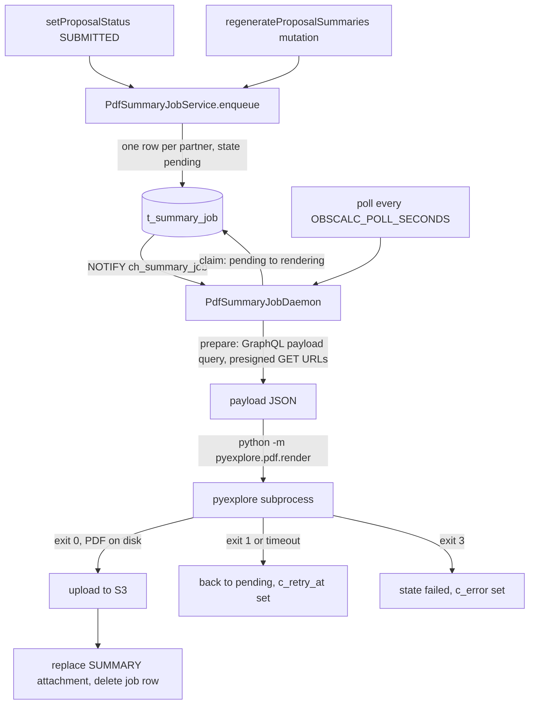
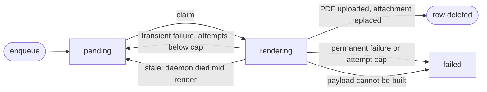

# PDF Summary Flow

## Overview

When a proposal is submitted, the ODB renders one summary PDF per partner and
attaches each to the program as a `SUMMARY` attachment. The rendering is done
by pyexplore (Python), which runs as a subprocess inside the `pdfsummary` dyno.
The ODB owns the whole job lifecycle; pyexplore only ever sees a JSON payload
and writes a PDF.

Work is a **durable, database-backed queue** (`t_summary_job`): one row per
(program, partner). The daemon drains it on startup, on NOTIFY, and on a
periodic poll, so nothing is lost if the dyno is down.

## Trigger Chain



A second request while a job for the same (program, partner) is already
`pending` is a no-op (unique index). A request while it is `rendering` is
allowed, so edits made during a render are picked up by the next one.

## `t_summary_job`

| Column | Meaning |
|---|---|
| `c_program_id`, `c_partner` | The pair being rendered. `c_partner` is null for a proposal with no partner splits. |
| `c_style` | Renderer style, derived from the partner (see below). |
| `c_state` | `pending`, `rendering`, `failed`. A finished job is deleted, not kept. |
| `c_attempts` | Incremented on each claim. Capped at `PdfSummaryJobService.MaxAttempts` (3). |
| `c_retry_at` | A `pending` job is not claimed before this. Backoff is 1, 4, 16 minutes by attempt. |
| `c_started_at` | When the current attempt was claimed. Drives the stale sweep. |
| `c_error` | Why the last attempt failed. Set on `failed` and on each reschedule. |

### State machine



`pending` back to `rendering` after the daemon dies mid-render is the stale
sweep: every call to `next` first fails or re-pends any `rendering` row older
than `StaleRender` (30 minutes), so a crashed dyno never strands a job.

### Partner to style

`SummaryStyle.forPartner`: CA renders `gemini-investigators-at-end`, CL
`chile`, KR `gemini-darp`, US `noirlab-darp`, everything else
`gemini-standard`.

## The Daemon

`PdfSummaryJobDaemon.run` (in `modules/service`, started by
`lucuma.odb.pdfsummary.PMain`) merges three streams into one wake-up queue:
LISTEN on `ch_summary_job`, a periodic poll, and a drain loop. The queue has
one slot, so any number of wake-ups collapse into a single drain, and jobs are
rendered **one at a time**: rendering is CPU and memory heavy and the dyno is
small.

Per job, the drain loop does:

1. `PdfSummaryJobService.next`: sweep stale jobs, claim the oldest ready
   `pending` row (`FOR UPDATE SKIP LOCKED`), then build the payload. The
   payload is the `PdfSummaryJobPayload` GraphQL query run as the service user
   through the `OdbMapping.forObscalc` mapping, plus presigned GET URLs for the
   science and team PDF attachments. An unbuildable payload fails the job
   permanently and the loop moves on.
2. `PdfRenderer.render`: writes the payload to a temp file and runs
   `python -m pyexplore.pdf.render --payload ... --style ... --output ... --itc-url ...`.
   Stdout and stderr are drained (a full pipe would hang the child); stderr
   becomes `c_error` on failure.
3. `PdfSummaryJobService.finalize`: upload the PDF to S3, and in one
   transaction delete the old `SUMMARY` attachment for that partner, insert
   the new one, delete the job row. The obsolete S3 object is then deleted,
   best effort.
4. On any error, `PdfSummaryJobService.fail`: permanent or capped attempts go
   to `failed`, otherwise back to `pending` with `c_retry_at`.

The LISTEN session dies with the database connection. The whole stream is
wrapped in `.attempts` with a 5 second delay so the daemon restarts rather than
sitting deaf until the next deploy.

## Renderer contract

Exit codes from `pyexplore.pdf.render`, documented in pyexplore's
`docs/pdf-render-contract.md`:

| Exit | Meaning | Job outcome |
|---|---|---|
| 0 | PDF written | done |
| 3 | Permanent: bad `schemaVersion`, unknown style | `failed`, no retry |
| anything else | Transient: attachment fetch failed, ITC down, bug | retry with backoff |
| killed at `PDF_SUMMARY_RENDER_TIMEOUT_SECONDS` | Transient | retry with backoff |

Exit code 2 is not used because argparse exits 2 on a usage error.

## Configuration

| Variable | Default | Meaning |
|---|---|---|
| `PDF_SUMMARY_PYTHON` | `/opt/pyexplore/bin/python` | Python with pyexplore installed |
| `PDF_SUMMARY_RENDER_TIMEOUT_SECONDS` | 600 | Kill a render after this |
| `PDF_SUMMARY_MAX_CONNECTIONS` | 4 | Skunk pool size (one LISTEN session plus the drain loop) |
| `PDF_SUMMARY_KEEP_TEMP_FILES` | false | Debugging only: keep payload and PDF on disk, log where |
| `OBSCALC_POLL_SECONDS` | 10 | Poll period, shared with obscalc |
| `ODB_ITC_ROOT` | | Passed to pyexplore as `--itc-url` |
| `CLOUDCUBE_*`, `DATABASE_URL`, `ODB_SERVICE_JWT` | | Same as the web dyno |

## Running locally

```bash
sbt pdfSummary/reStart        # or allStart, which now starts four services
```

`PDF_SUMMARY_PYTHON` must point at a Python with `pyexplore[pdf]` installed,
for example a venv in a checkout of pyexplore. Submit a proposal or call
`regenerateProposalSummaries` on the local web service, then watch
`t_summary_job` and `program { attachments { proposalSummary { partner style } } }`.

## The Docker image

`pdfSummary/docker:publishLocal` builds `noirlab/pdf-summary-service`: the
usual JRE image plus a Python venv with pyexplore installed at the commit
pinned by `pyexploreRef` in `build.sbt`. pyexplore is a private repository, so
the build needs `PYEXPLORE_TOKEN` in the environment (a read-only fine-grained
token). It is passed as a BuildKit secret and never stored in a layer; locally
it comes from `secrets.yaml` through the flake, on CI from the repository
secret of the same name.

## Taking changes from pyexplore

Nothing tracks pyexplore automatically: a change there reaches the ODB only
when someone bumps `pyexploreRef`. The bump is an ordinary PR and deploys
like any other ODB change, so it is reviewed, and reverting the one line rolls
the renderer back.

1. Pick the commit. Use a SHA on pyexplore's `main`, never a branch name, so
   the build stays reproducible and the commit cannot vanish with a branch.
2. Check the contract. Diff `pdf/render.py`, `pdf/payload.py` and
   `docs/pdf-render-contract.md` between the old and new pin. Anything that
   changes the CLI flags, the exit codes, or the payload keys pyexplore reads
   needs a matching change in `PdfRenderer` or `PdfSummaryJobPayload` in the
   same PR. A new required key means `PdfSummaryJobPayload.SchemaVersion` moves too.
3. Bump `pyexploreRef` in `build.sbt`.
4. Build and try the image locally, with `PYEXPLORE_TOKEN` in the environment:

   ```bash
   sbt pdfSummary/docker:publishLocal
   docker run --rm --entrypoint /opt/pyexplore/bin/python noirlab/pdf-summary-service \
     -m pyexplore.pdf.render --help
   ```

   For a real check, run the dyno locally against a dev database copy and
   regenerate a program's summaries; see "Running locally".
5. Open the PR. `build.sbt` counts as affecting every project, so the deploy
   job rebuilds and releases the image on merge even though no Scala changed.

The ODB test suites do not exercise the real renderer, so a contract break
shows up as `failed` jobs on dev after the merge, with the renderer's stderr
in `c_error`. Until a contract test exists, step 2 is the only guard.
