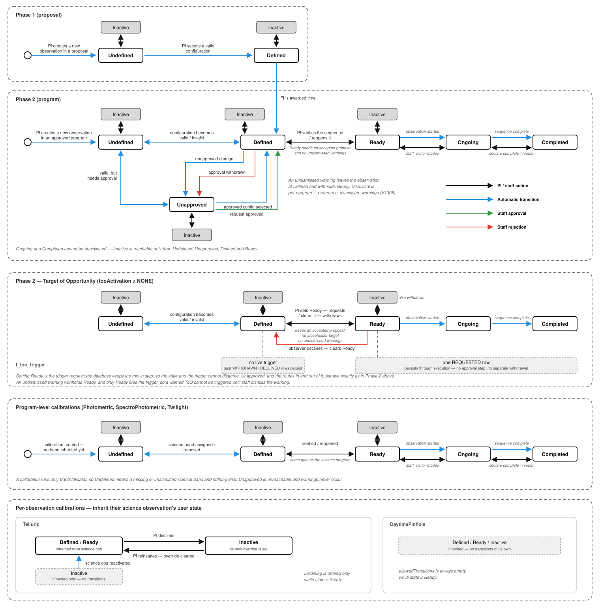

# Observation workflow states and transitions

Source of truth: `ObservationWorkflowService.workflowStateAndTransitions`
(`modules/service/src/main/scala/lucuma/odb/service/ObservationWorkflowService.scala`).

Black edges are the ones reachable through the `setObservationWorkflowState`
mutation — they are exactly the contents of `allowedTransitions`, with one
exception: the dashed black edge is a transition the mutation accepts for staff
and better but that never appears in `allowedTransitions` (see "Warnings and
ForReview"). Every other colour is a re-derivation that happens on its own,
distinguished by who triggers it: blue for the PI editing the observation,
green for a staff approval, red for a staff denial.



The five panels are, top to bottom: science observations in a proposal, science
observations in a program, Targets of Opportunity, program-level calibrations,
and per-observation calibrations. Each is described below.

## Main lifecycle

`Inactive` returns to `executionState.getOrElse(validationStatus)` — so if
execution has already begun it comes back as `Ongoing`/`Completed`, otherwise to
whatever the validation state recomputes to, which need not be the state it left.

### Defined and Unapproved

`Unapproved` is one state standing for four validation codes
(`validateConfigurations`): no request exists, all requests denied, or some
request still pending. There is no separate reviewed/unreviewed state — approval
lives entirely in `ConfigurationRequestStatus` — so each direction between
`Defined` and `Unapproved` has both a PI route and a staff route:

| Edge | Trigger |
|---|---|
| `Defined -> Unapproved` (blue) | PI changes the configuration to one no approved request covers |
| `Defined -> Unapproved` (red) | staff withdraws the approval that was holding it `Defined` |
| `Unapproved -> Defined` (blue) | PI changes the configuration to one an approved request already covers |
| `Unapproved -> Defined` (green) | staff approves the pending request |

`Defined` requires at least one request with status `Approved`. Note that denying
a request that was merely *pending* changes the validation code but not the
state — the observation stays `Unapproved` — so the red edge specifically means
revoking an approval, not the everyday act of rejecting a request.

### Warnings and ForReview

A warning is a validation code whose severity is `Nonfatal` — today that is only
`GenericWarning`, emitted by `ConditionsProbabilityValidator` (conditions
likelihood below 10%) and `TotalSignalToNoiseValidator` (total S/N below 3).
Warnings leave `validationStatus` at `Defined`; what they change is the exit:
from `Defined` with warnings, `allowedTransitions` offers `ForReview` in place
of `Ready`, under exactly the same gate conditions.

`ForReview` is a third stored user state (`for_review`, V1285) and otherwise
behaves like `Ready`: its transitions are `Inactive` and the validation state
(plus `Ongoing` under the usual visitor-mode-and-staff gate), and a validation
error suppresses it just as it suppresses a stored `Ready`.

Staff and better may set `Ready` anyway, whenever `ForReview` is among the
advertised transitions — that is, from `Defined` with warnings. This is the
dashed edge in the diagram, and it is deliberately **not** in
`allowedTransitions`: the cached workflow has no concept of who is asking, so
the transition set must be user-independent. The UI has to special-case it —
if `ForReview` is offered and the user is staff or better, also offer `Ready` —
and should paint warnings as dismissed once an observation has passed through
`ForReview`.

The override keys on `ForReview` being *offered*, so from `ForReview` itself
even staff cannot jump straight to `Ready` — the allowed set there is
`[Inactive, Defined]` — the route is back through `Defined`.

Note `for_review` sits between `defined` and `ready` in the enum order, so
`state <= Ready` comparisons (the per-observation calibration carve-outs)
include it.

## Targets of Opportunity

A ToO observation (i.e., an observation with a `tooActivation` other than `NONE`)
is "triggered" when its workflow state becomes `Ready`. In other words, a new
row is inserted in `t_too_trigger` to record the trigger timestamp and current
trigger state. A _database_ trigger on `t_observation` (`too_trigger_track_ready`,
V1246) watches `c_workflow_user_state` and `c_too_activation` together:

| Change | Effect                                              |
|---|-----------------------------------------------------|
| becomes `ready` while activation ≠ `NONE` | inserts a `REQUESTED` trigger in t_too_trigger      |
| leaves `ready`, or activation drops to `NONE` | marks the live trigger `WITHDRAWN` in t_too_trigger |

So `Defined -> Ready` is the request and `Ready -> Defined` is the withdrawal,
both using the ordinary `setObservationWorkflowState` mutation and its ordinary
authorization. There is no `requestTooTrigger`. Because `Defined -> Ready`
already requires an accepted proposal and forbids an opportunity asterism, a
trigger cannot be raised for an unapproved program or for an observation still
holding a placeholder target.

Warnings interact with this: a warned ToO observation offers only `ForReview`,
and `for_review` does **not** fire the database trigger — only `ready` does. So
a ToO with warnings cannot be triggered by its PI at all; staff must use the
unadvertised override to force `Ready`.

Note that `Inactive` and `Ready` share one column, so marking a triggered
observation inactive **withdraws its trigger**; returning it to `Ready` requests
a new one. That is intended — inactive means "do not observe this".

The one observer-side action is `declineTooTrigger` (staff), which records a
reason and clears the observation's `Ready` state, returning it to `Defined`.
The service sets the status *before* clearing the state so the database trigger
finds no `REQUESTED` row in `t_too_trigger` to withdraw and the decision, with
its reason, is what survives in the history.

There is deliberately no per-trigger approval: the proposal's ToO activation
ceiling, frozen at acceptance (V1245), is the authorization. Nor is there a
status meaning "executing" — the workflow already forbids leaving `Ongoing` for
`Defined`, so a live trigger cannot be withdrawn out from under a running
observation.

An opportunity target is a placeholder for a target not yet found, so it is a
`ConfigurationError` (hence `Undefined`) both when the observation declares no
ToO activation and when the observation has been set `Ready` — the latter a
backstop against swapping a placeholder back in after triggering.

## Calibrations

Two rules apply to **every** calibration role, whatever its kind:

- A calibration never runs the validation pipeline. `validationStatus` is forced
  to `Defined` as soon as `calibrationRole` is set, so a calibration is never
  `Undefined` or `Unapproved` — and it never carries warnings, so its
  `Defined -> Ready` edge never turns into `ForReview`. (A per-observation
  calibration can still *show* `ForReview`, inherited from its science
  observation's user state.)
- Calibration programs have `ProgramType.hasProposal == false`, so the
  `Defined -> Ready` gate passes without an accepted proposal.

Beyond that the five roles split into two groups:

| Role | Group | Lifecycle |
|---|---|---|
| `Photometric`, `SpectroPhotometric`, `Twilight` | program-level | the generic lifecycle above, entered at `Defined` |
| `Telluric`, `DaytimePinhole` | per-observation | inherits its science observation's user state; see below |

### Program-level calibrations

`Photometric`, `SpectroPhotometric`, and `Twilight` fall through to the generic
`else` branch of `allowedTransitions`, so they run the full lifecycle — they are
simply never gated on validation or on proposal acceptance. `Defined` is both the
entry point and the floor: because `validationStatus` is pinned to `Defined`, the
two edges that return "to the validation state" (`Ready -> validationStatus` and
`Inactive -> validationStatus`) always land back on `Defined`.

Compared with the main lifecycle, only the left-hand side changes: `Undefined`
and `Unapproved` are unreachable, and `Defined -> Ready` carries no
proposal-acceptance condition. Everything from `Ready` rightwards is identical,
including the staff-and-visitor-mode restriction on `Ready <-> Ongoing`.

### Per-observation calibrations

Tellurics and daytime pinholes are auto-created alongside their science
observation and normally have **no** transitions of their own — they inherit the
science observation's user state. SC-8458 carves out one exception, for tellurics
only (see `../../../docs/adr/0008-telluric-decline-override.md`).

A telluric that is `Inactive` only because its science observation is inactive
offers no transitions — there is no override to clear. Both calibration carve-outs
apply only while `state <= Ready`; once execution begins the generic rules resume.

## Transition conditions

| Transition | Requires |
|---|---|
| `Defined -> Ready` | no warnings, not an exchange observation, not a target of opportunity, and (proposal accepted or program has no proposal — `hasProposal` is true only for `Science`, `Keck`, `Subaru`) |
| `Defined -> ForReview` | warnings present, otherwise the same conditions as `Defined -> Ready` |
| `Defined -> Ready` (dashed, unadvertised) | `ForReview` is among the advertised transitions **and** staff access or above |
| `Ready/ForReview -> Ongoing`, `Ongoing -> Ready` | visitor observing mode **and** staff access or above |
| `Completed -> Ongoing` | execution state was explicitly declared complete, not naturally complete |
| `Telluric -> Inactive` | calibration role is `Telluric` and `state <= Ready` |
| `Telluric Inactive -> inherited` | the telluric's own `c_workflow_user_state` is `Inactive` |

Exchange observations (Keck/Subaru) run off-Gemini and have no
`Ready`/`Ongoing`/`Completed` lifecycle at all; `Inactive` is their only
transition out of `Defined`.

## DB Columns

The state is not stored as a single column. It is computed each time, from three
independent sources, in this precedence order:

| Kind | Members | Where it comes from |
|---|---|---|
| `ExecutionState` | `Ongoing`, `Completed` | `c_declared_execution_state`, else the generator's execution state |
| `UserState` | `Inactive`, `Ready`, `ForReview` | `c_workflow_user_state` — for a ToO observation, `Ready` also maintains a row in `t_too_trigger` |
| `ValidationState` | `Undefined`, `Unapproved`, `Defined` | validation codes computed from the observation |

Execution wins over user state, which wins over validation — except that a
validation error suppresses a stored `Ready` or `ForReview` (but never a stored
`Inactive`).

## Regenerating the diagram

There is nothing to regenerate: `observation-workflow.svg` is hand-authored and
is its own source. It is deliberately not produced from mermaid or any other
text format — the readability depends on hand-placed nodes (`Inactive` stacked
above each state, `Unapproved` dropped below the row, the legend parked in the
gap), and auto-layout engines will not reproduce that.

To change it, edit the SVG directly. The header comment lists the shared column
positions and the per-panel `y` bands; keeping equivalent states on the same
column is what makes the panels comparable at a glance.

To preview a change on macOS:

```bash
qlmanage -t -s 1520 -o /tmp docs/observation-workflow.svg   # writes /tmp/observation-workflow.svg.png
```

`qlmanage` crops to a square rather than fitting, so part of the diagram is cut
off either way. To see the whole thing, temporarily pad the `viewBox`/`width` to
a square (`0 0 1540 1540`) in a scratch copy, or just open the file in a browser,
which honours the real aspect ratio.

When adding a panel, extend the root `viewBox`, `height` and the background
`<rect>` to match. Appending at the bottom leaves every existing coordinate
alone. Inserting one in the middle — as the Target of Opportunity panel was,
to keep it next to the Phase 2 panel it varies — means shifting every panel
below it. That is mechanical, because the calibration panels use only
`y`/`y1`/`y2`/`cy` attributes and no `path` data:

```bash
perl -pi -e 'if ($. >= 182 && $. <= 262) { s/\b(y|y1|y2|cy)="(\d+)"/$1 . "=\"" . ($2+320) . "\""/ge }' observation-workflow.svg
```

Check the line range and the offset first, and re-render afterwards — a panel
that uses `path d="…"` coordinates would need those edited by hand as well.
