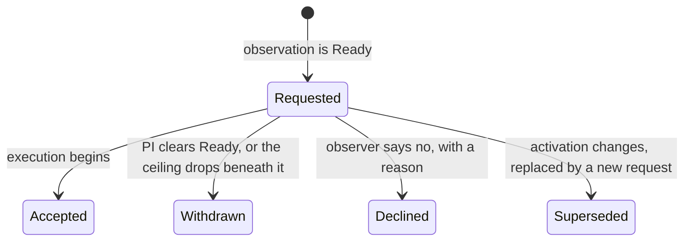

# Target of Opportunity Overview

*Work-in-progress Target-of-Opportunity support proposal.*

A Target of Opportunity is an observation that is awaiting an anticipated event
and is not schedulable beforehand. Usually the target itself is unknown when the
proposal is written — a supernova, a gamma-ray burst, a gravitational-wave
counterpart — and all that can be said in advance is the region of sky it might
appear in. Sometimes, though, the target is known perfectly well and what is
unknown is *when* it will do something worth observing. Typically a survey
telescope says when by sending an event that matches a PI's interest. Regardless,
the observation sits waiting until someone declares that the moment has come and
it is now available to be scheduled.

Due to their disruptive nature, appearing mid-semester and often requiring high
priority attention, support for ToO observations is needed in the GPP Lucuma ODB
and API.  This document covers what is needed and how it will be provided. It covers:

* [§1](#1-the-target-of-opportunity-target) Placeholder ToO targets.
* [§2](#2-scheduling-mode) Scheduling modes and limitations placed on them by ToOs. 
* [§3](#3-what-makes-an-observation-a-too) Distinct types of ToO observations.
* [§4](#4-what-approval-grants) How scheduling modes and ToO activations are approved,
and how that keeps disruptive triggers out of programs without TAC authorization.
* [§5](#5-triggering) The trigger process itself including the lifecycle of an individual trigger request.
* [§6](#6-what-clients-can-do) What the API offers and how clients work with it.
* [§7](#7-scheduling-windows) A word about scheduling windows.
* [§8](#8-time-accounting) A disclaimer about time accounting.

Finally the current state of the work is listed in a table found in
[Where Things Stand](#where-things-stand).

---

## 1. The Target of Opportunity Target

A ToO observation usually cannot name its target in advance, but it may be able to say
where in the sky the event might occur. That is what an **opportunity target** is for: a
placeholder that stands in the asterism, carrying a **region**, an arc of right
ascension and an arc of declination bounding the approved patch of sky, along with
the name and source profile the ITC needs to produce exposure times before the real
object is known.  A target that names no region, or names an arc in only one axis,
is approved for **the whole sky** in what it left out.

When the alert arrives a real object (an ordinary sidereal or nonsidereal target) takes
the placeholder's place in the asterism — see [§5](#5-triggering). So the placeholder is
a pre-trigger artifact; the thing to which you eventually slew is a plain target like
any other, read the same way every other target is read.

### How the Approved Region is Used

Each observation's **configuration** — its conditions, target, observing mode and
scheduling mode — is recorded in a configuration request at proposal submission, and for
an observation still holding its placeholder the target part is a *region*. Those
records are what staff approve. They are stored independently of any observation.
(The observation's ToO activation is not part of its configuration; it is approved
program-wide, as the program's ceiling — see [§4](#4-what-approval-grants).)

Approval is then matched to an observation on demand, by asking whether an existing
approved configuration subsumes the observation's current one. A region subsumes
coordinates that fall inside it, and subsumes a smaller region. So swapping the
placeholder opportunity target for a real target keeps the approval if the target
is inside the approved patch and loses it if it is not, and a *new* ToO observation
drawing a region no larger than an approved one is covered without any new request
being made.

Note that approval is program-wide rather than per-observation: though originally
extracted from a proposal's observations, a configuration request is not tied to
a particular observation.  For observations alike in conditions and observing mode
the approved regions effectively union.

### Caveats and Limitations

* **After acceptance a region is descriptive, not restrictive.**  A region only
constrains anything by *becoming* an approved configuration. Once the
program is accepted, an observation is checked against the union of approved
configurations and never against its own region, so drawing a tighter region on a new
observation restricts nothing. A target outside the tighter region but inside an
approved one is accepted silently, with no warning. 

* **The check asks about a position rather than a path.**  Whether a moving target stays 
inside the region *for the duration of the observation* is a further question. And the
position it asks about is where the target sits at the **midpoint of the call's active
period**, a proposal-era reference point, not the night the ToO is actually observed.
For a sidereal target that distinction is a proper-motion correction and for practical
purposes does not matter. For a fast moving nonsidereal target on the other hand it may
be critical.  This issue is of yet unresolved.

* **Withdrawing a trigger does not undo the swap.** The real target stays in the 
asterism and the placeholder is not restored since the approval that matters lives
in the stored configurations. A PI who wants to wait on another alert may put an
opportunity target back themselves, or not.

## 2. Scheduling Mode

Every observation carries a **scheduling mode**, which answers one question: what is
the scheduler allowed to do *to* this observation? The three values form a ladder, each
rung keeping everything below it and adding one more restriction:

| Mode                | Means                                                                                              | Typical reason                                    |
|---------------------|----------------------------------------------------------------------------------------------------|---------------------------------------------------|
| **Unconstrained**   | The scheduler may do as it likes: split the sequence across nights, interrupt it, resume it later. | The default. Most queue observations.             |
| **NoSplitting**     | Must be executed as a single visit; cannot be broken into multiple visits.                         | A sequence that only makes sense taken in one go. |
| **Uninterruptible** | The above, and no Target of Opportunity may interrupt it once it is running.                       | An observation that must not be disturbed.        |

Two things worth stating plainly:

**`NoSplitting` can still be interrupted, and interrupting it destroys the work.**
"Cannot be split" and "cannot be interrupted" are different promises. If a
`NoSplitting` observation is interrupted, it is abandoned and restarted from the
beginning rather than resumed as a second visit.  That is precisely what makes it
different from `Uninterruptible`.

**The Scheduling Mode applies to normal observations as well.** `Uninterruptible` is ordinary
science. An observation that must not be disturbed requires it whether or not anything
about it is waiting on an alert. Every rung above `Unconstrained` constrains the
scheduler, so the mode is part of the observation's configuration and is approved with
it ([§4](#4-what-approval-grants)). A program with a few short timing windows gets
`Uninterruptible` for the observations that need it, and only those. The converse is
constrained though: a `Rapid` or `Interrupting` ToO is pinned to `Uninterruptible` by
the rule in [§3](#3-what-makes-an-observation-a-too), so for those two the mode is not a
separate choice.

What an observation may do *to others* is a separate question, answered by its ToO
activation — see [§3](#3-what-makes-an-observation-a-too). And *when* it must happen
is a third, answered by scheduling windows — see [§7](#7-scheduling-windows).

## 3. What Makes an Observation a ToO

Every observation carries a ToO activation, and an observation is a Target of Opportunity
exactly when that value is above `None`:

| Activation       | Means                                                                  |
|------------------|------------------------------------------------------------------------|
| **None**         | Not a Target of Opportunity; observed whenever convenient. The default. |
| **Rapid**        | Observed as soon as possible, but does not displace ongoing work.      |
| **Interrupting** | Observed as soon as possible, displacing ongoing work where permitted. |

There is deliberately **no "standard" level** between `None` and `Rapid`. A standard ToO —
one waiting on an event but content to be observed whenever convenient once it happens —
would be scheduled exactly like ordinary queue science and record no trigger, leaving
nothing but a label to distinguish it from `None`. A label with no consequence gets
applied inconsistently. Such an observation is simply `None`. If its target is unknown
it carries an opportunity target, whose region is approved like any other configuration
([§1](#1-the-target-of-opportunity-target)), and it cannot be set `Ready` until the real
target is swapped in ([§5](#5-triggering)). Clients are free to label the lowest level
"None/Standard"; the API calls it `None`.

This is a **declared, not derived** value. The PI sets it on the observation alongside the
scheduling mode. Nothing about the asterism decides it, so an observation does not stop
being a ToO when its opportunity target is swapped out at the moment of the trigger
([§5](#5-triggering)). In the other direction, adding an opportunity target to an
observation whose activation is `None` does not make it a ToO. It remains an ordinary
observation, one that cannot be set `Ready` until it says where it is pointing. Nothing
about the asterism can change an observation's activation by accident, in either direction.

Scheduling mode and ToO activation are separate, but constrained by **a single rule**:

> `Rapid` and `Interrupting` ToOs have a scheduling mode of `Uninterruptible`, which
> cannot be changed.

An observation that displaces other science must not itself be displaceable, and one
promised as soon as possible should not be broken up once it starts. So raising an
observation to `Rapid` or `Interrupting` sets its scheduling mode to `Uninterruptible`,
and while it stays there the mode cannot be edited. The reverse does not happen:
lowering the activation back to `None` **leaves the mode `Uninterruptible`**, and the PI
may relax it if they wish. An automatic downgrade would quietly change something the
observation was scheduled under, which is always a surprise.

**An interrupting ToO can never interrupt anything `Uninterruptible`**, which by the
rule above includes every `Rapid` and `Interrupting` ToO. The scheduler never has to
choose between two of those mid-execution. What an interrupting ToO *can* displace is
an observation whose mode is `Unconstrained` or `NoSplitting`, and any observation that
must not be displaced says so by being `Uninterruptible`.

The activation is a statement about what an observation is *permitted* to do, and about
how promptly its PI is asking for it. What the scheduler makes of that is the
scheduler's business: we record the activation and the scheduling mode and make them
available, and the scheduling policy built on top of them is outside our scope.

## 4. What Approval Grants

Both the scheduling mode and the ToO activation are set on the observation, but they are
approved in different places.

**The scheduling mode is approved with the configuration.** It is part of the
configuration that a **configuration request** records, alongside the conditions, target
and observing mode ([§1](#how-the-approved-region-is-used)). An approved request covers
an observation only if its configuration subsumes the observation's, and a mode subsumes
itself and every rung below it. So an observation raised to `Uninterruptible` after
acceptance is `Unapproved` until a request at that mode is approved, and a `NoSplitting`
observation is covered by an approved `Uninterruptible` configuration that otherwise
matches. A `Rapid` or `Interrupting` ToO is `Uninterruptible` ([§3](#3-what-makes-an-observation-a-too)),
so it too needs a configuration approved at `Uninterruptible`; an approval for ordinary
science at a looser mode does not cover it. The forced mode gets no exemption.

**The ToO activation is approved program-wide, as the program's ceiling.** A program
may carry a **ToO activation ceiling**, and an observation's activation must be at or
below it, whatever its configuration. This is what lets a ToO program create new ToO
observations after acceptance — at trigger time, from a template, as a follow-up —
without waiting on a review for each: the TAC approved the program's appetite for
disruption, not just one observation's. The activation is no part of a configuration
request.

So an observation is covered when **both** hold:

1. an approved configuration request subsumes the observation's configuration, scheduling
   mode included (for programs whose configurations need approval), and
2. the program has no ceiling, or the observation's activation is at or below it.

**The ceiling lives on the program, and null means no restriction.** It applies to any
program, with or without a proposal and whatever the proposal type, and a set ceiling is
enforced the same way everywhere. A program without a proposal — engineering,
commissioning, calibration — has none by default, so anything goes; if staff give it
one, it is enforced like any other. The whole rule is: a set ceiling is enforced, a null
one is not.

**Acceptance sets the default.** When a proposal is accepted and the program has no
ceiling yet, it gets one: `None` for classical, poor weather and Keck proposals, which
ordinarily have no Targets of Opportunity, and otherwise the highest activation among the
program's observations. A ceiling staff already set, say during review, is kept. Nothing
is enforced before acceptance, since there is no ceiling yet. Leaving `Accepted` leaves
the ceiling alone.

**Staff may set or clear it.** The ceiling is an ordinary program property,
`tooActivationCeiling` on `ProgramPropertiesInput`, so staff set it through `createProgram`
or `updatePrograms`; null clears it, and leaving it out of an edit leaves it alone. Like
the other approval-type program properties, only staff may set it. (NGO users were meant
to share the right on programs with time from their partner, but `updatePrograms` cannot
serve NGO users at all yet.)

Raising the ceiling lets observations above the old value become ready. Lowering it makes
observations above the new value `Unapproved`, and any outstanding trigger they have is
withdrawn ([§5](#trigger-lifecycle)): the observatory should not be looking at a live
request for a disruption the program is no longer permitted to cause. Clearing it lifts
the restriction and withdraws nothing.

This is not quite how the science summary phrased it ("the highest setting in any
approved configuration is allowed in new observations"), but it grants the same thing:
what the TAC saw is what the program may reach, and going beyond it takes staff sign-off.
It does so without carrying a program-wide grant on a per-configuration record.

**Exchange proposals are held to the ceiling like any other.** A Subaru program's
ceiling is set at acceptance and enforced the same way, even though exchange
observations have no configuration requests.

**The two axes are approved differently on purpose.** The ceiling exists because ToO
observations are created after acceptance, in response to events, and cannot wait for a
review. That argument belongs to the activation alone. An ordinary observation that
wants `Uninterruptible` has no such urgency, so the mode stays per-configuration even in
a ToO program. Nor does anything switch on whether a program "is" a ToO program: in a
program whose observations ask for no ToO, the ceiling acceptance sets is simply `None`,
which every `None` observation satisfies.

Approval is settled in advance, and nothing further is asked of anyone at the moment of
the trigger. Setting an observation `Ready` needs no additional sign-off: requiring one
would add latency to exactly the observations where minimal latency is the whole point.
The one refusal is at the mutation: a `Ready` observation may not be raised above the
ceiling, since that would put a request for an ungranted disruption in front of the
observatory. A `Defined` one may, and is `Unapproved` until staff raise the ceiling.

**The proposal type only sets a default.** Classical, poor weather and Keck proposals
ordinarily have no Targets of Opportunity, but since staff may grant one a ceiling, an
activation above `None` is not refused there. Instead, until a ceiling is set, such an
observation carries a `TOO_ACTIVATION_UNEXPECTED` warning saying acceptance will limit it
to `None` unless staff grant more. Once a ceiling exists, it speaks for itself.

### Defaults

A new observation is born at the lowest level of each: scheduling mode `Unconstrained`,
activation `None`. Anything higher is a deliberate choice, so a program asking for
`Rapid` or `Interrupting` must mark the observations that need it before acceptance, and
the default ceiling follows from them.

### What the Proposal Shows

Every program reports two summaries, whatever its type: `maxTooActivation`, the highest
activation among its observations, and `maxSchedulingMode`, the most restrictive mode.
Both are descriptive, uncapped by the proposal type, and enforce nothing. The ceiling is
reported separately as `Program.tooActivationCeiling`, null when there is none. The PDF
summary reads `maxTooActivation`, handed to the renderer where it read the old
proposal-level field. How the Proposal tab and the PDF present the two summaries is still
to be discussed.

### Existing Programs

Configuration requests gain the scheduling mode. Which observations a request covers is
computed in the service, not in SQL, so the backfill is program-wide: each existing
request takes the highest scheduling mode among its program's observations. That
over-grants slightly — each configuration gets what the program uses anywhere — but only
for programs that predate the change, since the mode was never approved before.

The ceiling moves from the proposal to the program. An accepted program keeps the
ceiling its proposal had, explicit or frozen at acceptance, or gets the default if it had
neither. Every other program starts with none, which drops any ceiling a PI chose before
acceptance, since PIs no longer choose one.

## 5. Triggering

Triggering a ToO means setting the observation **`Ready`**, the same state used for
every other observation. As soon as an observation is `Ready`, a **trigger** record
appears. There is no separate "request" mutation that could drift out of step with the
observation's state. The state *is* the request.

For a ToO whose target was known at the outset, marking it `Ready` is the only
required action. Such an observation is explicitly valid: what it is waiting for is
the moment, not the identity of the target. For one still holding a placeholder,
the real target must also take the placeholder's place. The target for placeholder
swap is an ordinary asterism edit, unlinking the opportunity target and linking the
real one.

The swap has to come first. An observation still holding an opportunity target has
nothing to point at, so the `Defined -> Ready` transition is refused while the
placeholder is in its asterism. The reverse is not blocked: `Ready` is a pre-execution
state, so an opportunity target can be swapped back *into* a `Ready` observation. Doing
so withdraws the outstanding trigger. Putting a placeholder in is a deliberate return
to the waiting state, and an observation with nothing to point at must not leave a
live request in front of an observer.

The observation being triggered need not be exactly one the proposal described. Copying
a ToO observation and swapping the target on the copy leaves the original in place as a
template, which is the natural shape for a program that expects to trigger repeatedly:
each alert mints its own observation, with its own visits and its own trigger record,
and nothing is overwritten.

**Every ToO gets a trigger record**, `Rapid` and `Interrupting` alike. Someone declared
that the moment had come, and that declaration is worth recording, attributing, and
broadcasting. An observation at `None` records no trigger; setting it `Ready` is the
ordinary workflow step it is for every other observation.

Triggering also gives the observation a **default scheduling window** if it does not
already have one, which is what expresses "observe this promptly". An observation that
came with its own scheduling windows keeps them. See [§7](#7-scheduling-windows).

### Trigger Lifecycle

`Requested` is the only non-terminal state; every other status ends the request. The
observatory's implicit affirmative answer to the request is **`Accepted`**, recorded at
the first non-slew execution event. This is the same moment the observation transitions
to `Ongoing`. A trigger cannot be withdrawn out from under a running observation, since
the workflow forbids backing out of `Ongoing`.

`Declined`, `Withdrawn` and `Superseded` are, for the purpose of triggering again,
equivalent to never having been triggered: setting the observation `Ready` once more
produces a new trigger rather than reviving an old one. They are kept distinct because
they answer different questions. `Accepted` is terminal in a stronger sense: the
request was answered and execution began.

### Editing Post-Trigger and Trigger History

**A trigger is a prompt, not a promise that the observation can run right now.** If the
observation is later edited into a state where it cannot be executed — a configuration
falls out of approval, something required goes missing — the request stays outstanding.
Nothing bad follows from that: an observation that cannot execute does not execute, and
clients that care can read the observation's workflow state alongside the trigger.

The reasoning is that a request stops being a request when the PI takes it back, or when
the observatory revokes what it granted but not when the observation is temporarily broken.
A broken observation still has a PI waiting on it, and the request records when *they*
asked, which is the number that matters when the point is promptness.

Every attempt is its own record, so the full history accumulates: a PI who sets `Ready`
again after a decline gets a fresh trigger, and the earlier one remains as a record of
what happened. Every transition is attributed and timestamped.

**A trigger records the activation at which it was requested, and that never changes.**
Triggering a rapid ToO and an interrupting one are effectively different requests
because who is listening, how fast they might react, and what they are expected to drop
all differ. So if the observation's activation moves while a request is outstanding,
the request is **superseded**: it closes out, and a successor takes its place carrying the
new activation. The successor's `supersedes` points back at what it replaced, so the chain is
walkable and the root of it answers "when did this observation first go live at any
activation". Lowering the activation to `None` is not a move to another activation: it
ends the observation's life as a ToO, so the outstanding request is withdrawn rather
than superseded.

## 6. What Clients Can Do

**Trigger or withdraw a ToO.**  On the PI side, everything goes through the ordinary
observation API, target and asterism mutations: set the ToO activation and scheduling mode,
swap the real target in when the alert arrives, and set the observation `Ready`. Clearing
`Ready` withdraws the request.

**Decline one.** Staff may use `declineTooTrigger(tooTriggerId:, reason:)` to record that
an observer saw a trigger and chose not to act on it, with a reason, and to return the
observation to `Defined`.

Declining is deliberately distinct from a trigger simply sitting there. An outstanding
trigger is live: the observation is under consideration and it may be picked up at any
time. A PI can therefore distinguish "the observatory has not started this yet" from
"this was seen and was rejected".  The first says nothing about whether anyone has looked.

**Watch for triggers as they happen.** The `tooTriggerEdit` subscription delivers every
creation and lifecycle transition, filterable by program, observation, a single trigger,
or the activation the request was made at. The activation filter is ordered, so a
dashboard that only cares about the most disruptive can subscribe with
`tooActivation: { GTE: INTERRUPTING }` and be told about nothing else. This is what an
observer's dashboard would sit on, a ToO appearing mid-night shows up without polling.

Changing an observation's ToO activation while a trigger is outstanding supersedes that
trigger with a new one at the new activation. To a subscriber this arrives as two
ordinary events: the predecessor closing out, then the successor appearing. The closing
event reports the predecessor's *own* activation rather than the new one, since that is
what the record says. A client filtered to one activation sees a request leave its view
and, if it moved into scope, arrive again under its new identity.

**Query them.** `tooTrigger(tooTriggerId:)` for one, `tooTriggers(WHERE:)` for many,
filtered by status and by activation among other things. The activation filter is
ordered, so "at least interrupting" is expressible. Each carries its observation, status,
activation, the request it superseded if any, the time and user of the request, and
the reason accompanying any terminal transition.

## 7. Scheduling Windows

Triggering gives an observation a default scheduling window if it has none, but a PI
may instead supply their own. How tight of a window the observatory is willing to accept
is settled in the same place everything else about a ToO is settled: at proposal acceptance.

The program records a **Minimum Scheduling Window** (MSW): the least *total* open time over
the course of its active period that the observatory commits to accommodating for any
of its observations. Total is the operative word. A window may open and close many times
across the program's active period, and any one of those openings may be very short indeed
while the openings together add up to something quite workable. What the MSW bounds is
their sum, not the length of any single opening.

An observation whose windows sum to less than the MSW is asking for more promptness than
the program was approved for, and is `Unapproved` until they widen or the MSW does.

## 8. Time Accounting

Genuinely open. An interrupting ToO has to be charged in some way, and the observation
it interrupted discounted. How that is apportioned is not settled.

## Where Things Stand

"Built (branch)" means done on the `too-2` branches of `lucuma-core` and `lucuma-odb`,
which merge together as a single schema change once Explore has caught up.

| Piece                                                                              | Status                                                                       |
|------------------------------------------------------------------------------------|------------------------------------------------------------------------------|
| Trigger records, lifecycle, subscription, decline mutation                         | built                                                                        |
| `Accepted` recorded at the first non-slew execution event                          | built                                                                        |
| Trigger records its activation; a change supersedes it                             | built                                                                        |
| Region reaches the configuration request and is enforced at the observed position  | built — carries over to swapping and to cloning unchanged                    |
| `SchedulingMode` reduced to three rungs; `Interrupting` moved onto `TooActivation` | built (branch)                                                               |
| ToO-ness declared per observation rather than derived from the asterism            | built (branch)                                                               |
| Opportunity target resolution removed in favour of swapping                        | built (branch)                                                               |
| Trigger gated on `Ready` alone rather than `Ready` + resolved                      | built (branch)                                                               |
| `Standard` merged into `None`                                                      | built (branch) — existing rows become `None`; `standard` triggers deleted    |
| `Rapid`/`Interrupting` set and lock `Uninterruptible`; no downgrade                | built (branch)                                                               |
| New observations born at the lowest level of each                                  | built (branch)                                                               |
| Scheduling mode on the configuration, approved by subsumption                      | built (branch)                                                               |
| Ceiling on the program; default at acceptance; staff set or clear it               | built (branch) — a program property; null means no restriction               |
| PI-set ceiling, ceiling submission checks, proposal-type refusal                   | removed (branch) — the type refusal is now a warning                         |
| Backfill of existing requests and ceilings                                         | built (branch) — see [§4](#existing-programs)                                |
| `Program.maxTooActivation` and `maxSchedulingMode` summaries                       | built (branch) — the PDF payload reads `maxTooActivation`                    |
| How the Proposal tab and PDF present the summaries                                 | **to discuss**                                                               |
| Default scheduling window applied at trigger time                                  | designed, not yet built                                                      |
| Minimum Scheduling Window recorded at acceptance and enforced                      | designed, not yet built — see [§7](#7-scheduling-windows)                    |
| Region enforced over a path                                                        | **deferred** — needs science staff input, see [§1](#caveats-and-limitations) |
| Time accounting for interrupting ToOs                                              | **open** — see [§8](#8-time-accounting)                                      |
