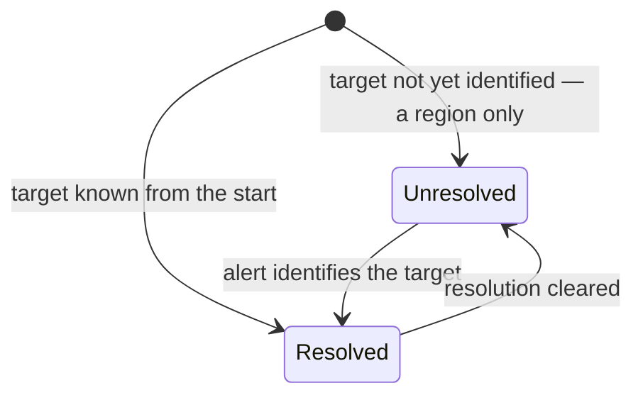
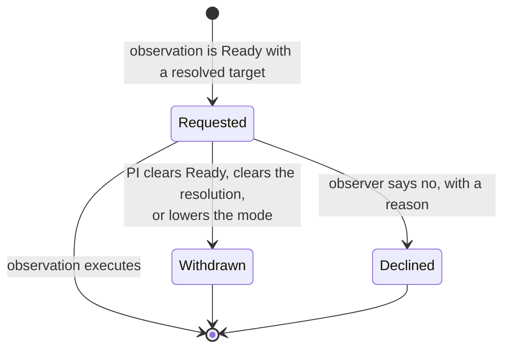

# Target of Opportunity Scheduling — Overview

*Work-in-progress Target-of-Opportunity support proposal.*

---

## The idea in one paragraph

A Target of Opportunity is an observation that waits for an **alert** rather than for
the queue. Usually the target itself is unknown when the proposal is written — a
supernova, a gamma-ray burst, a gravitational-wave counterpart — and all that can be
said in advance is the region of sky it might appear in. Sometimes, though, the target
is known perfectly well and what is unknown is *when* it will do something worth
observing; a survey telescope says when. Either way the observation sits waiting until
someone declares that the moment has come, and the thing that has to be settled in
advance is **how much disruption it is then allowed to cause**.

---

## 1. Scheduling mode

Every observation carries a **scheduling mode**. It answers a single question: what is
the scheduler allowed to do with this observation? The four values form a ladder, each
rung keeping everything below it and adding one restriction:

| Mode | Means | Typical reason |
|---|---|---|
| **Unconstrained** | The scheduler may do as it likes: split the sequence across nights, interrupt it, resume it later. | The default. Most queue observations. |
| **NoSplitting** | Must be executed as a single visit; cannot be broken into multiple visits. | A sequence that only makes sense taken in one go. |
| **Uninterruptible** | The above, and no Target of Opportunity may interrupt it once it is running. | A long exposure, or a ToO that must not be disturbed. |
| **Interrupting** | The above, and *this* observation may interrupt one that is already executing. | The most disruptive ToOs — the ones worth stopping other science for. |

Two things worth stating plainly:

**`NoSplitting` can still be interrupted, and interrupting it destroys the work.**
"Cannot be split" and "cannot be interrupted" are different promises. If a
`NoSplitting` observation is interrupted, it is abandoned and restarted from the
beginning rather than resumed as a second visit — that is precisely what makes it
different from `Uninterruptible`.

**An interrupting ToO can never interrupt another ToO.** Because `Interrupting` sits
above `Uninterruptible` on the ladder, every ToO aggressive enough to interrupt others
is itself uninterruptible. There is deliberately no tie-break within the top tier: the
scheduler never has to choose between two ToOs mid-execution.

**`Interrupting` is only available to a Target of Opportunity.** The three rungs below
it are useful on ordinary observations too, but stopping executing science is something
only a ToO gets to do. An observation set to `Interrupting` without a ToO target is
rejected rather than merely unusual — see [§3](#3-what-makes-an-observation-a-too).

Scheduling mode says nothing about urgency. *When* an observation must happen is a
timing-window question — see [§5](#5-triggering).

---

## 2. The Target of Opportunity target

A ToO observation is marked as one by carrying a special kind of target — an
**opportunity target**. What makes it special is not that its position is unknown, but
that it belongs to an observation waiting on an alert. It carries a **region**: an arc
of right ascension and an arc of declination bounding where the event may occur, which
is part of what the TAC approves. A target that names no region — or names an arc in
only one axis — is approved for **the whole sky** in what it left out. That is the
weakest thing it can say rather than a missing answer, so there is no such thing as a
ToO without a region.

An opportunity target is either **unresolved** — region only, position not yet known —
or **resolved**, carrying real coordinates or an ephemeris. Both are ordinary states:

- A ToO whose target is not known in advance **starts unresolved** and is resolved when
  the alert identifies it.
- A ToO whose target is known all along **starts resolved**. Nothing is waiting on the
  position; what is waiting is the decision that now is the time.

Crucially, resolving a target **does not stop it being an opportunity target**. It does
not turn into an ordinary sidereal target. It keeps its region and its identity, and
the resolution can be cleared again.

This matters for three practical reasons:

- **The observation stays recognizable as a ToO** after it has been triggered. If the
  target turned into a plain sidereal target, every question asked afterwards — which
  observations were ToOs, did this program stay within what it was approved for, how
  much ToO time was used — would have no answer.
- **The approved region survives to be enforced.** A ToO is authorized to disrupt
  other science within a particular patch of sky, and that patch outlives the
  resolution rather than being discarded at the moment it starts to matter.

  **A resolution outside the region blocks the observation**, and it does so through
  the approval the observation already needs rather than through a rule of its own. A
  configuration request made while the target is unresolved records the *region*, and
  an approval of a region covers any coordinates inside it — so resolving within the
  approved patch keeps the approval, and resolving outside it drops the observation to
  `Unapproved`, which blocks `Ready` and therefore blocks the trigger.

  Two limits are worth knowing. It asks about a position rather than a path, so
  whether a moving target stays inside the region *for the duration of the
  observation* is a further question. And the position it asks about is where the
  target sits at the **midpoint of the call's active period** — a proposal-era
  reference point, not the night the ToO is actually observed. For a sidereal target
  that distinction is a proper-motion correction and does not matter; for a fast mover
  it may be the whole question.

  Who may redraw a region, and when, is open too. Narrowing one ought to be fine, and
  a new ToO target may legitimately want a region tighter than anything the TAC saw.
- **Everything downstream keeps working.** A resolved ToO behaves exactly like the
  target it resolved to — for the ITC, guide star selection, sequence generation, the
  archive duplication search, and GHOST IFU assignment. Only an *unresolved* one is
  special, and an unresolved target cannot reach `Ready`.

An opportunity target may resolve to a sidereal *or* a nonsidereal target. Nothing in
the design assumes sidereal.

---

## 3. What makes an observation a ToO

Nothing is declared. An observation is a Target of Opportunity **exactly when its
asterism contains an opportunity target**. Any observation is allowed to have one.

Its **ToO activation** — the vocabulary the proposal, the TAC, and the ITAC queue
engine already use — follows from that plus the scheduling mode:

| Has an opportunity target? | Scheduling mode | ToO activation |
|---|---|---|
| no | any | **None** |
| yes | Unconstrained or NoSplitting | **Standard** |
| yes | Uninterruptible | **Rapid** |
| yes | Interrupting | **Interrupting** |

**`Interrupting` is the one mode that needs a ToO target.** Science staff report no
application for an interrupting observation that isn't a Target of Opportunity, so
rather than giving that combination a meaning we reject it: an observation set to
`Interrupting` with an ordinary asterism is **undefined** and cannot be executed, until
either a ToO target is added or the mode comes down. The three lower modes carry no
such requirement — `Uninterruptible` in particular is ordinary and useful on a long
exposure that must not be broken up.

So a PI has exactly one knob to turn. Add the opportunity target, choose how disruptive
the observation may be, and the activation follows. There is no second field to keep in
step, and nothing to lose by changing your mind.

**All ToOs are scheduled like ordinary queue observations.** There is no separate ToO
queue and no special path through the scheduler. What a trigger does is prompt the
scheduler to reconsider what to do next; it then weighs the observation like any other,
taking the scheduling mode and any timing windows into account. The activation level is
a statement about what the observation is *permitted* to do when that reconsideration
happens — not a different mechanism.

---

## 4. What the proposal authorizes

A proposal carries a **ToO activation ceiling**: the most disruptive activation any of
its observations may reach. Before submission it is derived from the observations
themselves, so a PI who simply marks up their observations gets a coherent proposal
without filling in a second form.

At **acceptance the ceiling is frozen**. From that point it is an authorization rather
than a description — the TAC saying in advance how much disruption this program may
cause. An observation that exceeds it is flagged as *unapproved* and cannot reach
`Ready` until either the mode comes down or the ceiling goes up.

This is the only approval step. There is no second, per-trigger sign-off: requiring one
would add latency to exactly the observations where latency is the whole point.

---

## 5. Triggering

Triggering a ToO means setting the observation **`Ready`** — the same state used for
every other observation. For a ToO whose target was known all along, that is the only
action. For one still waiting to be identified, the target must also be resolved; the
two can happen in either order, and the trigger appears once both hold.

As soon as an observation is `Ready` with a resolved opportunity target, a **trigger**
record appears. There is no separate "request" mutation that could drift out of step
with the observation's state — the state *is* the request.

**Every ToO gets a trigger record**, at any activation level. A standard ToO may well
be picked up in the ordinary course of the night and a rapid one may not be, but from
the record-keeping point of view they are the same event: someone declared that the
moment had come, and that declaration is worth recording, attributing, and
broadcasting.

Triggering also gives the observation a **default scheduling window** if it does not
already have one, which is what expresses "observe this promptly". An observation that
came with its own timing windows keeps them.

`Requested` is the only non-terminal state, and a requested trigger simply stays
requested while the observation executes. Nothing here records "execution has begun" —
that lives in the execution events, and the workflow already forbids leaving `Ongoing`,
so a trigger cannot be withdrawn out from under a running observation.

Every attempt is its own record, so the full history accumulates: a PI who sets `Ready`
again after a decline gets a fresh trigger, and the earlier one remains as a record of
what happened. Every transition is attributed and timestamped.

---

## 6. What clients can do

**Watch for triggers as they happen.** The `tooTriggerEdit` subscription delivers every
creation and lifecycle transition, filterable by program, observation, or a single
trigger. This is what an observer's dashboard would sit on — a ToO appearing mid-night
shows up without polling.

**Query them.** `tooTrigger(tooTriggerId:)` for one, `tooTriggers(WHERE:)` for many,
filtered by status among other things. Each carries its observation, status, the time
and user of the request, and the reason accompanying any terminal transition.

**Decline one.** `declineTooTrigger(tooTriggerId:, reason:)` records that an observer
saw a trigger and chose not to act on it, with a reason, and returns the observation to
`Defined`.

Declining is deliberately distinct from a trigger simply sitting there. An outstanding
trigger is live: the scheduler has the observation under consideration and it may be
picked up at any time. So what a PI can tell apart is "the observatory has not started
this yet" from "this was seen and is not being done" — the first says nothing about
whether anyone has looked.

**On the PI side**, everything goes through the ordinary observation and target
mutations: set the scheduling mode, resolve the opportunity target if it is not already
resolved, set the observation `Ready`. Clearing `Ready` or clearing the resolution
withdraws the request.

---

## 7. Still open

**How permissive to be with short timing windows.** A triggered ToO gets a default
scheduling window, and a PI may supply their own. How short a window we are willing to
accept — and what happens when one cannot be met — is not settled. It does not block
anything else.

**Time accounting.** An interrupting ToO has to be charged in some way, and the
observation it interrupted discounted. How that is apportioned is not settled.

**How a ToO observation comes to exist in the first place.** Everything above is
deliberately agnostic about that. A ToO observation might be built from scratch and
then triggered, copied from a template, or assembled to match a set of science
requirements and a target. The scaffolding described here is meant to support whichever
of those we end up wanting, and does not presume one.

---

## What this replaces

An earlier iteration of this work gave the observation two separate fields: an
**execution requirement** (splittable / uninterruptible) and its own **ToO
activation**, tied together by a rule where raising one silently raised the other, plus
a matching default-and-floor arrangement on top. It worked, but the interaction between
the two fields was hard to explain and hard to reason about. The scheduling mode above
collapses both into a single ladder, and the activation is derived rather than stored.
That earlier design is being dropped, not extended.

---

## Where things stand

| Piece | Status |
|---|---|
| ToO activation ceiling on the proposal, frozen at acceptance | in `main` |
| Trigger records, lifecycle, subscription, decline mutation | in `main` |
| Opportunity target survives resolution, resolvable to sidereal or nonsidereal | built, under review |
| `SchedulingMode` replacing the two current observation-level fields | designed, not yet built |
| Derived ToO activation | designed, not yet built |
| Default scheduling window applied at trigger time | designed, not yet built |
| Region enforced at the resolved position, via configuration approval | in `main`, and now exercised |
| Region enforced over a path, and who may edit a region | **deferred** — needs science staff input, see [§2](#2-the-target-of-opportunity-target) |

Until the scheduling mode lands, the API still exposes the two-field version described
under [What this replaces](#what-this-replaces).
