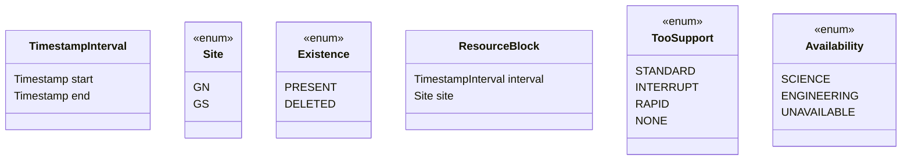
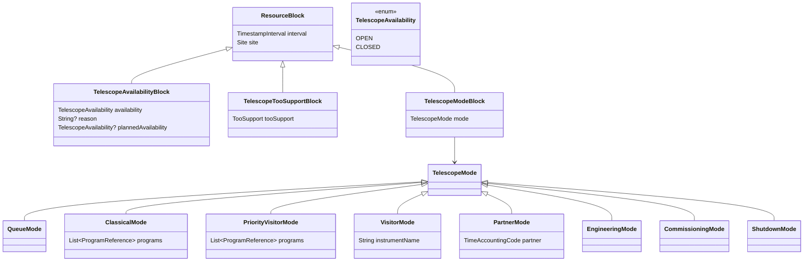
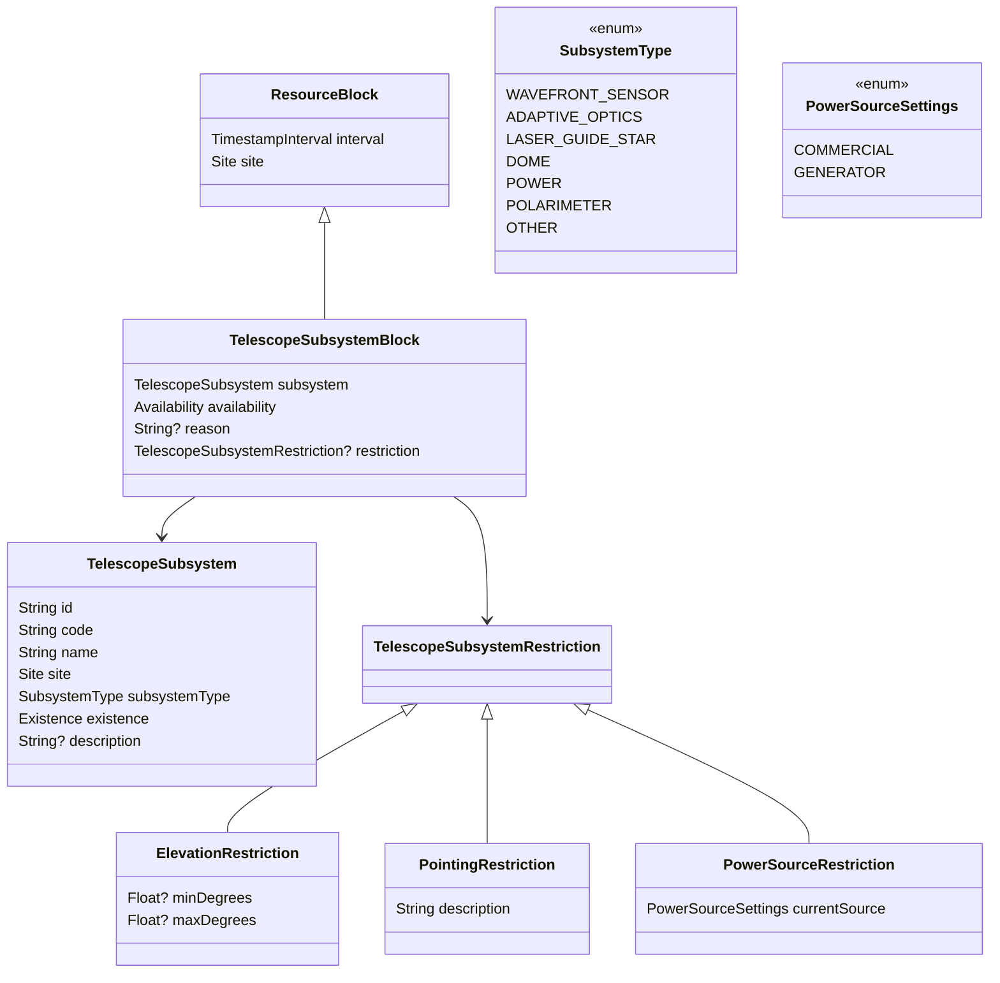
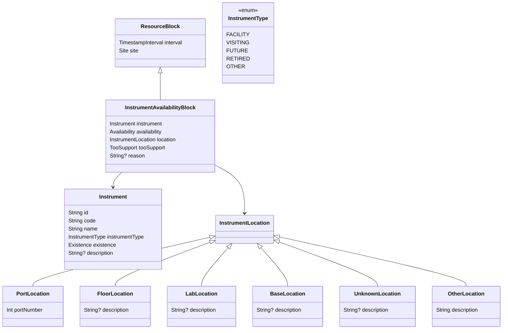
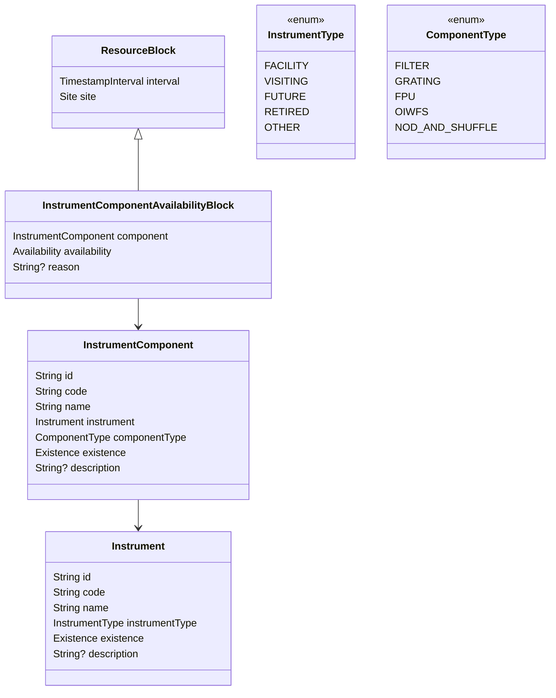

# Resource Service — v1

This document defines the Resource domain model.

RUI = Resource User Interface

Resource is the source of truth for telescope scheduling resources. It separates stable catalog definitions from time-bounded operational blocks.

Catalog definitions describe what exists. Resource blocks describe what is available, where, and when.

## Design Rules

Resource uses common Lucuma/GPP model types where possible:

- `TimestampInterval` from `lucuma-core` for `[start, end)` time ranges
- `Site` from `lucuma-core` for `GN` and `GS`
- `Existence` from GPP/Lucuma-style models for soft delete behavior

Catalog definitions should not be hard-deleted after use. They use `Existence` so historical blocks can continue to reference them.

Catalog records use two identifiers:

- `id` is the stable opaque Resource identifier. It uses the compact public ID style used by GPP for programs and observations, with an appropriate Resource prefix.
- `code` is the machine-friendly technical identifier. It replaces values that were previously modeled as application enums when those values should be managed as Resource data.

Codes are catalog data, not GraphQL enum values, unless a model explicitly defines an enum for constrained behavior.

Resource blocks always have `site` and `interval`. This keeps scheduler and RUI queries consistent:

```text
site + interval -> operational state
```

Some catalog records also have `site` when the catalog object is intrinsically site-specific. This is intentional. The block site supports operational queries. The catalog site defines ownership.

## Core Types



`Availability` applies to resources that can be used for science, reserved for engineering, or unavailable.

## Telescope

Telescope blocks describe site-level scheduling state over time. A single observing night may contain multiple time-bounded blocks.



`TelescopeAvailabilityBlock` answers whether the telescope can be scheduled at all.

`TelescopeTooSupportBlock` answers which ToO class is accepted during the interval.

`TelescopeModeBlock` answers which observing mode or scheduling restriction applies during the interval. Block scheduling is represented by multiple `TelescopeModeBlock` records within a night.

## Telescope Subsystems

Telescope subsystems are site-specific catalog definitions. Subsystem availability and restrictions are Resource blocks.



`TelescopeSubsystem` is a Resource catalog record. Each subsystem has a stable opaque `id`, an open machine-friendly `code`, and a constrained `subsystemType`.

`TelescopeSubsystem` is site-specific because subsystems are part of telescope/site infrastructure. The same subsystem code may exist at both sites, but each site has its own catalog record so availability, restrictions, and history can be tracked independently.

`TelescopeSubsystemBlock.site` must match `TelescopeSubsystem.site`.

A block with `site = GS` pointing to a `GN` subsystem is invalid.

## Instruments

Instruments are catalog definitions. They describe what the instrument is, not its operational state.

An instrument's operational state is represented by an `InstrumentAvailabilityBlock`, which records where the instrument is, whether it is available for scheduling, and any scheduler-relevant metadata for a given time interval.



`Instrument` is a Resource catalog record. Each instrument has a stable opaque `id`, an open machine-friendly `code`, and a constrained `instrumentType`.

`Instrument` does not store `site` directly because site assignment is operational state. The site is represented by time-bounded `InstrumentAvailabilityBlock` records.

The `location` field gives more specific location information within or outside that site, such as a port, floor, lab, base, unknown location, or other described location.

## Instrument Components

Instrument components are catalog definitions owned by a specific instrument. Availability is modeled separately.



`InstrumentComponent` is a Resource catalog record. Each component has a stable opaque `id`, an open machine-friendly `code`, and a constrained `componentType`.

`code` is the technical identifier for the component within its instrument and component type. Examples include `R_PRIME`, `G_PRIME`, `GG455`, and `B1200_G5301`.

User-facing names such as `r′` belong in `name`. Clearer labels such as `GMOS-N r′ filter` belong in `description`.

`InstrumentComponentAvailabilityBlock.site` identifies the site that the time-bounded operational block applies to.
